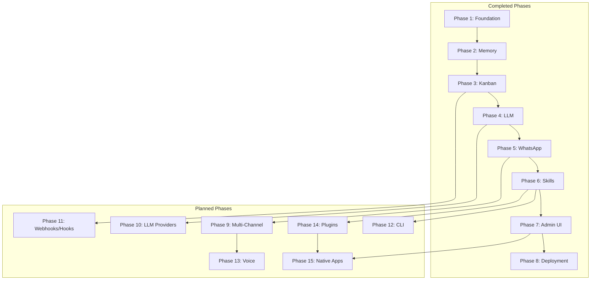

# Botty AI Assistant - Development Roadmap

This document provides an overview of all development phases for Botty, tracking completed work and planning future enhancements to close the gap with full-featured AI assistants like OpenClaw.

## Completed Phases (1-8)

| Phase | Description | Status |
|-------|-------------|--------|
| 1 | .NET solution, Docker, Postgres schema, secrets, Soul.md | Completed |
| 2 | Memory system (models, repository, ingestion, retrieval, trust layer) | Completed |
| 3 | Kanban workflow with approval gating, scheduler, cron jobs | Completed |
| 4 | LLM abstraction layer, Claude 4.5 Opus, Soul.md integration | Completed |
| 5 | Node.js WhatsApp bridge with QR auth and approval integration | Completed |
| 6 | Skills framework with sensitive config, Gmail, GCal, shell access | Completed |
| 7 | Next.js admin UI with Kanban board and Soul.md editor | Completed |
| 8 | GCP deployment with Terraform, Cloud Run, and CI/CD | Completed |

## Planned Phases (9-15)

| Phase | Description | Priority | Complexity | Status |
|-------|-------------|----------|------------|--------|
| [9](phase-09-multi-channel.md) | Multi-channel messaging (Telegram, Slack, Discord) | High | Medium | Planned |
| [10](phase-10-llm-providers.md) | Multiple LLM providers with failover | High | Medium | Planned |
| [11](phase-11-webhooks-hooks.md) | Webhooks and event hooks | Medium | Medium | Planned |
| [12](phase-12-cli.md) | Command-line interface | Medium | Low | Planned |
| [13](phase-13-voice.md) | Voice capabilities (STT/TTS) | Medium | High | Planned |
| [14](phase-14-plugins.md) | Plugin hot-loading runtime | Medium | High | Planned |
| [15](phase-15-native-apps.md) | PWA and native applications | Low | Very High | Planned |

## Phase Dependencies

## Recommended Implementation Order

Based on value delivered and technical dependencies:

1. **Phase 9 + 10 (Parallel)** - Multi-channel and LLM providers can be developed simultaneously as they touch different parts of the codebase
2. **Phase 11** - Webhooks/hooks builds on the scheduler foundation
3. **Phase 12** - CLI provides power-user access and can aid development
4. **Phase 13** - Voice capabilities after channel infrastructure is solid
5. **Phase 14** - Plugin system is architecturally significant, do after core is stable
6. **Phase 15** - Native apps are the largest effort, do last

## Key Architectural Decisions

### Channel Plugin Architecture (Phase 9)
All messaging channels will implement a unified `IChannelPlugin` interface, allowing the system to treat WhatsApp, Telegram, Slack, etc. identically from the core's perspective.

### LLM Provider Chain (Phase 10)
A `ILlmProviderChain` will wrap multiple providers with automatic failover, health tracking, and credential rotation to maximize reliability.

### Event-Driven Hooks (Phase 11)
Moving beyond cron-only scheduling to a full event-driven system where any system event (message received, task approved, etc.) can trigger automation.

### Plugin Runtime (Phase 14)
Using `AssemblyLoadContext` for plugin isolation with hot-reload support, enabling community extensions without recompilation.

## Gap Analysis vs OpenClaw

| Feature | Botty (Current) | OpenClaw | Gap Phase |
|---------|-----------------|----------|-----------|
| Channels | WhatsApp only | 15+ channels | Phase 9 |
| LLM Providers | Claude only | Multiple + failover | Phase 10 |
| Automation | Cron jobs | Hooks, webhooks, PubSub | Phase 11 |
| CLI | None | Full CLI | Phase 12 |
| Voice | None | STT/TTS/Calls | Phase 13 |
| Plugins | Compile-time skills | Hot-loading + ClawHub | Phase 14 |
| Apps | Web UI only | Native + PWA | Phase 15 |

## Botty's Differentiators

Features Botty has that OpenClaw emphasizes less:

- **Approval Workflow** - Kanban-based human-in-the-loop for all side effects
- **Memory System** - Semantic memory with pgvector and trust layer
- **Soul.md** - Declarative personality configuration with versioning
- **Enterprise Deployment** - Cloud-native GCP architecture (vs local-first)
