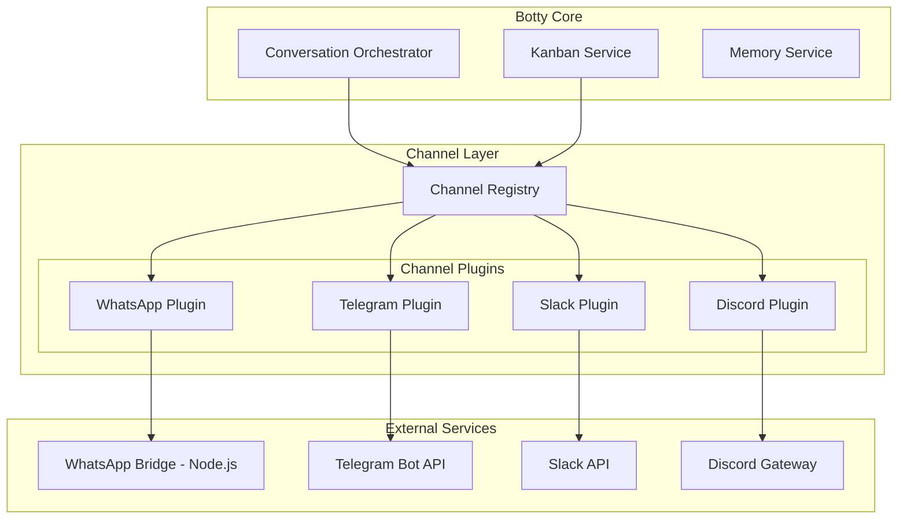

# Phase 9: Multi-Channel Messaging Support

## Overview

Extend Botty beyond WhatsApp to support multiple messaging channels including Telegram, Slack, Discord, and others. This phase introduces a unified channel plugin architecture that allows the core system to interact with any messaging platform through a common interface.

### Goals

- Create a pluggable channel architecture with `IChannelPlugin` interface
- Implement native C# support for Telegram, Slack, and Discord
- Refactor existing WhatsApp bridge to conform to the new interface
- Add channel management to the Admin UI
- Support channel-specific features (threads, reactions, media) where available

### Non-Goals

- iMessage support (macOS-only, requires significant platform work)
- Signal support (requires separate sidecar like WhatsApp)
- End-to-end encryption management

## Architecture



## Interface Definitions

### IChannelPlugin

```csharp
namespace Botty.Channels;

public interface IChannelPlugin
{
    // Identification
    string Id { get; }
    string Label { get; }
    string Description { get; }
    
    // Capabilities
    ChannelCapabilities Capabilities { get; }
    ChannelConfigSchema ConfigSchema { get; }
    
    // Lifecycle
    Task InitializeAsync(ChannelConfig config, CancellationToken ct = default);
    Task<ChannelStatus> GetStatusAsync(CancellationToken ct = default);
    Task DisconnectAsync(CancellationToken ct = default);
    
    // Outbound messaging
    Task<SendResult> SendTextAsync(OutboundMessage message, CancellationToken ct = default);
    Task<SendResult> SendMediaAsync(OutboundMediaMessage message, CancellationToken ct = default);
    Task<SendResult> SendReactionAsync(string chatId, string messageId, string emoji, CancellationToken ct = default);
    
    // Inbound events
    event EventHandler<IncomingMessage> MessageReceived;
    event EventHandler<MessageReaction> ReactionReceived;
    event EventHandler<ChannelEvent> EventReceived;
}

public class ChannelCapabilities
{
    public bool SupportsMedia { get; init; } = true;
    public bool SupportsThreads { get; init; } = false;
    public bool SupportsReactions { get; init; } = false;
    public bool SupportsEdits { get; init; } = false;
    public bool SupportsDeletes { get; init; } = false;
    public bool SupportsVoiceNotes { get; init; } = false;
    public bool SupportsTypingIndicator { get; init; } = false;
    public bool SupportsReadReceipts { get; init; } = false;
    public int MaxMessageLength { get; init; } = 4096;
    public string[] SupportedMediaTypes { get; init; } = ["image/jpeg", "image/png", "image/gif"];
}

public record ChannelStatus(
    bool IsConnected,
    string? AccountId,
    string? AccountName,
    DateTime? ConnectedSince,
    string? Error
);

public record OutboundMessage(
    string ChatId,
    string Text,
    string? ReplyToMessageId = null,
    string? ThreadId = null
);

public record OutboundMediaMessage(
    string ChatId,
    Stream MediaStream,
    string MediaType,
    string? FileName = null,
    string? Caption = null
);

public record IncomingMessage(
    string MessageId,
    string ChatId,
    string SenderId,
    string SenderName,
    string Text,
    DateTime Timestamp,
    string ChannelId,
    MessageType Type = MessageType.Text,
    string? MediaUrl = null,
    string? ReplyToMessageId = null,
    string? ThreadId = null
);

public enum MessageType
{
    Text,
    Image,
    Video,
    Audio,
    Voice,
    Document,
    Location,
    Contact,
    Sticker
}

public record SendResult(
    bool Success,
    string? MessageId = null,
    string? Error = null
);
```

### IChannelRegistry

```csharp
public interface IChannelRegistry
{
    // Registration
    void Register(IChannelPlugin plugin);
    void Unregister(string channelId);
    
    // Discovery
    IChannelPlugin? GetChannel(string channelId);
    IEnumerable<IChannelPlugin> GetAllChannels();
    IEnumerable<IChannelPlugin> GetConnectedChannels();
    
    // Lifecycle management
    Task InitializeAllAsync(CancellationToken ct = default);
    Task<ChannelStatus> GetStatusAsync(string channelId, CancellationToken ct = default);
    
    // Unified messaging
    Task<SendResult> SendToChannelAsync(string channelId, OutboundMessage message, CancellationToken ct = default);
    
    // Events
    event EventHandler<ChannelMessageEventArgs> MessageReceived;
}

public class ChannelMessageEventArgs : EventArgs
{
    public required string ChannelId { get; init; }
    public required IncomingMessage Message { get; init; }
}
```

## Implementation Tasks

### Task 1: Create Botty.Channels Project

Create a new class library project for the channel abstraction layer.

**Files to create:**
- `botty/src/Botty.Channels/Botty.Channels.csproj`
- `botty/src/Botty.Channels/IChannelPlugin.cs`
- `botty/src/Botty.Channels/IChannelRegistry.cs`
- `botty/src/Botty.Channels/Models/*.cs`
- `botty/src/Botty.Channels/Base/BaseChannelPlugin.cs`
- `botty/src/Botty.Channels/Registry/ChannelRegistry.cs`

### Task 2: Refactor WhatsApp to Channel Plugin

Convert the existing WhatsApp integration to implement `IChannelPlugin`.

**Changes:**
- Create `WhatsAppChannelPlugin` wrapper around the Node.js bridge
- Update `WhatsAppController` to use the channel abstraction
- Maintain backward compatibility with existing bridge

### Task 3: Implement Telegram Channel

Native C# implementation using `Telegram.Bot` NuGet package.

**Files to create:**
- `botty/src/Botty.Channels/Telegram/TelegramChannelPlugin.cs`
- `botty/src/Botty.Channels/Telegram/TelegramConfig.cs`

**Key implementation:**
```csharp
public class TelegramChannelPlugin : BaseChannelPlugin
{
    public override string Id => "telegram";
    public override string Label => "Telegram";
    
    private TelegramBotClient? _client;
    
    public override async Task InitializeAsync(ChannelConfig config, CancellationToken ct)
    {
        var botToken = await config.GetSecretAsync("bot_token", ct);
        _client = new TelegramBotClient(botToken);
        
        _client.OnMessage += HandleMessage;
        await _client.StartReceiving(
            HandleUpdateAsync,
            HandleErrorAsync,
            cancellationToken: ct
        );
    }
    
    public override async Task<SendResult> SendTextAsync(OutboundMessage message, CancellationToken ct)
    {
        var chatId = long.Parse(message.ChatId);
        var result = await _client!.SendTextMessageAsync(
            chatId: chatId,
            text: message.Text,
            replyToMessageId: message.ReplyToMessageId != null 
                ? int.Parse(message.ReplyToMessageId) 
                : null,
            cancellationToken: ct
        );
        
        return new SendResult(true, result.MessageId.ToString());
    }
}
```

### Task 4: Implement Slack Channel

Using `SlackNet` NuGet package for Slack API integration.

**Files to create:**
- `botty/src/Botty.Channels/Slack/SlackChannelPlugin.cs`
- `botty/src/Botty.Channels/Slack/SlackConfig.cs`

**Key features:**
- Bot token authentication
- Socket Mode for real-time events
- Thread support
- Reactions support

### Task 5: Implement Discord Channel

Using `Discord.Net` NuGet package for Discord Gateway.

**Files to create:**
- `botty/src/Botty.Channels/Discord/DiscordChannelPlugin.cs`
- `botty/src/Botty.Channels/Discord/DiscordConfig.cs`

**Key features:**
- Bot token authentication
- Gateway connection for real-time events
- Thread/forum channel support
- Reactions support
- Slash commands (optional)

### Task 6: Update Admin UI

Add channel management page to the Next.js admin application.

**Files to create/modify:**
- `admin-ui/src/app/channels/page.tsx` - Channel list and status
- `admin-ui/src/components/channels/channel-card.tsx` - Individual channel card
- `admin-ui/src/components/channels/channel-config-modal.tsx` - Configuration form
- `admin-ui/src/lib/api.ts` - Add channel API client

**UI Features:**
- List all registered channels with connection status
- Configure channel credentials (routed to secret store)
- Connect/disconnect channels
- View channel-specific metrics

### Task 7: Add API Endpoints

Create REST endpoints for channel management.

**Endpoints:**
```
GET    /api/channels              # List all channels
GET    /api/channels/{id}         # Get channel details
GET    /api/channels/{id}/status  # Get connection status
POST   /api/channels/{id}/connect # Initialize connection
POST   /api/channels/{id}/disconnect
PUT    /api/channels/{id}/config  # Update configuration
POST   /api/channels/{id}/send    # Send message (for testing)
```

## Database Changes

### Channel Configuration Table

```sql
CREATE TABLE channel_configs (
    id UUID PRIMARY KEY DEFAULT gen_random_uuid(),
    channel_id VARCHAR(50) NOT NULL UNIQUE,
    enabled BOOLEAN NOT NULL DEFAULT false,
    config JSONB NOT NULL DEFAULT '{}',
    last_connected_at TIMESTAMPTZ,
    last_error TEXT,
    created_at TIMESTAMPTZ NOT NULL DEFAULT NOW(),
    updated_at TIMESTAMPTZ NOT NULL DEFAULT NOW()
);

CREATE INDEX idx_channel_configs_channel_id ON channel_configs(channel_id);
```

### Message Routing Table (Optional)

For multi-channel message routing rules:

```sql
CREATE TABLE channel_routes (
    id UUID PRIMARY KEY DEFAULT gen_random_uuid(),
    name VARCHAR(100) NOT NULL,
    source_channel_id VARCHAR(50),
    destination_channel_id VARCHAR(50) NOT NULL,
    condition JSONB,  -- e.g., {"sender_contains": "@important"}
    is_active BOOLEAN DEFAULT true,
    created_at TIMESTAMPTZ NOT NULL DEFAULT NOW()
);
```

## Configuration

### appsettings.json

```json
{
  "Channels": {
    "Telegram": {
      "Enabled": true,
      "PollingTimeout": 30
    },
    "Slack": {
      "Enabled": true,
      "UseSocketMode": true
    },
    "Discord": {
      "Enabled": true,
      "GatewayIntents": ["Guilds", "GuildMessages", "DirectMessages"]
    }
  }
}
```

### Secrets (via ISecretStore)

| Secret Key | Description |
|------------|-------------|
| `channel_telegram_bot_token` | Telegram Bot API token |
| `channel_slack_bot_token` | Slack Bot OAuth token |
| `channel_slack_app_token` | Slack App-level token (for Socket Mode) |
| `channel_discord_bot_token` | Discord Bot token |

## Testing Strategy

### Unit Tests

- `ChannelRegistry` registration and lookup
- Message model serialization/deserialization
- Configuration validation

### Integration Tests

- Mock Telegram API responses
- Mock Slack Socket Mode events
- Mock Discord Gateway events

### Manual Testing

1. Create test bots for each platform
2. Send test messages and verify receipt
3. Test media upload/download
4. Verify approval workflow integration

## Dependencies

### NuGet Packages

| Package | Version | Purpose |
|---------|---------|---------|
| `Telegram.Bot` | 19.x | Telegram Bot API client |
| `SlackNet` | 0.x | Slack API client |
| `SlackNet.AspNetCore` | 0.x | Slack ASP.NET Core integration |
| `Discord.Net` | 3.x | Discord API client |

### External Services

- Telegram: Create bot via @BotFather
- Slack: Create app at api.slack.com
- Discord: Create application at discord.com/developers

## Risks and Mitigations

| Risk | Impact | Mitigation |
|------|--------|------------|
| Rate limiting by platforms | Messages delayed/dropped | Implement per-channel rate limiters, queue outbound messages |
| API breaking changes | Channel stops working | Pin package versions, monitor changelogs |
| Session/token expiration | Disconnection | Implement auto-reconnect, health monitoring |
| Different message formats | Inconsistent behavior | Normalize all messages to `IncomingMessage` model |

## Success Criteria

- [ ] All three new channels (Telegram, Slack, Discord) can send/receive messages
- [ ] WhatsApp continues working with the new architecture
- [ ] Admin UI shows all channels with accurate status
- [ ] Incoming messages from all channels appear in Kanban workflow
- [ ] Outbound messages from approval queue are delivered to correct channel
