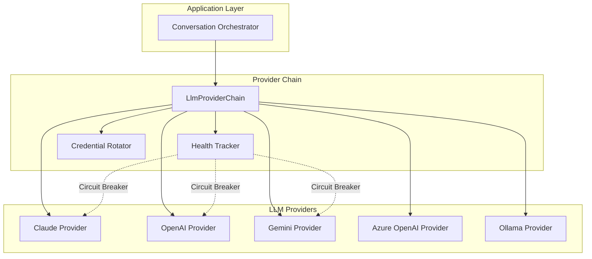

# Phase 10: Multiple LLM Providers with Failover

## Overview

Extend Botty's LLM integration beyond Claude to support multiple providers (OpenAI, Google Gemini, Azure OpenAI, Ollama) with automatic failover, health tracking, and credential rotation. This ensures high availability and allows users to choose the best model for their needs.

### Goals

- Create an `ILlmProviderChain` that wraps multiple providers
- Implement health tracking with circuit breaker pattern
- Add OpenAI, Google Gemini, Azure OpenAI, and Ollama providers
- Support credential/profile rotation for rate limit management
- Provide configuration for provider priority and failover rules

### Non-Goals

- Fine-tuning or model training
- Cost optimization algorithms (future phase)
- Prompt caching across providers

## Architecture



## Interface Definitions

### ILlmProviderChain

```csharp
namespace Botty.LLM;

public interface ILlmProviderChain
{
    // Primary operations with automatic failover
    Task<LlmResponse> CompleteWithFailoverAsync(
        LlmRequest request, 
        CancellationToken ct = default);
    
    IAsyncEnumerable<string> StreamWithFailoverAsync(
        LlmRequest request, 
        CancellationToken ct = default);
    
    Task<float[]> GetEmbeddingWithFailoverAsync(
        string text, 
        CancellationToken ct = default);
    
    // Provider management
    void SetPrimaryProvider(string providerId);
    void SetFallbackOrder(IEnumerable<string> providerIds);
    IEnumerable<string> GetAvailableProviders();
    
    // Health monitoring
    ProviderHealth GetHealth(string providerId);
    IEnumerable<ProviderHealthSummary> GetAllHealthSummaries();
    
    // Manual control
    Task<LlmResponse> CompleteWithProviderAsync(
        string providerId, 
        LlmRequest request, 
        CancellationToken ct = default);
}
```

### ProviderHealth

```csharp
public class ProviderHealth
{
    public string ProviderId { get; init; } = default!;
    public bool IsHealthy => State == CircuitState.Closed || State == CircuitState.HalfOpen;
    public CircuitState State { get; private set; } = CircuitState.Closed;
    
    // Failure tracking
    public int ConsecutiveFailures { get; private set; }
    public int TotalFailures { get; private set; }
    public DateTime? LastFailureAt { get; private set; }
    public string? LastError { get; private set; }
    
    // Rate limiting
    public bool IsRateLimited => RateLimitedUntil > DateTime.UtcNow;
    public DateTime? RateLimitedUntil { get; private set; }
    public int RateLimitHitsToday { get; private set; }
    
    // Performance
    public TimeSpan AverageLatency { get; private set; }
    public int RequestsToday { get; private set; }
    public int SuccessesToday { get; private set; }
    
    // Circuit breaker settings
    public int FailureThreshold { get; init; } = 3;
    public TimeSpan OpenDuration { get; init; } = TimeSpan.FromMinutes(1);
    
    public void RecordSuccess(TimeSpan latency)
    {
        ConsecutiveFailures = 0;
        RequestsToday++;
        SuccessesToday++;
        UpdateAverageLatency(latency);
        
        if (State == CircuitState.HalfOpen)
            State = CircuitState.Closed;
    }
    
    public void RecordFailure(Exception ex)
    {
        ConsecutiveFailures++;
        TotalFailures++;
        LastFailureAt = DateTime.UtcNow;
        LastError = ex.Message;
        RequestsToday++;
        
        if (ex is RateLimitException rle)
        {
            RateLimitedUntil = rle.RetryAfter;
            RateLimitHitsToday++;
        }
        
        if (ConsecutiveFailures >= FailureThreshold)
        {
            State = CircuitState.Open;
            // Schedule transition to HalfOpen
        }
    }
}

public enum CircuitState
{
    Closed,     // Normal operation
    Open,       // Failing, not accepting requests
    HalfOpen    // Testing if recovered
}
```

### Credential Rotation

```csharp
public interface ICredentialRotator
{
    Task<ApiCredential> GetNextCredentialAsync(string providerId, CancellationToken ct = default);
    void ReportCredentialFailure(string providerId, string credentialId, Exception ex);
    void ReportCredentialSuccess(string providerId, string credentialId);
}

public class ApiCredential
{
    public required string Id { get; init; }
    public required string ApiKey { get; init; }
    public string? OrganizationId { get; init; }
    public int RequestsRemaining { get; set; } = int.MaxValue;
    public DateTime? RateLimitResetsAt { get; set; }
}

public class RotatingCredentialProvider : ICredentialRotator
{
    private readonly Dictionary<string, List<ApiCredential>> _credentials = new();
    private readonly Dictionary<string, int> _currentIndex = new();
    private readonly ISecretStore _secretStore;
    
    public async Task<ApiCredential> GetNextCredentialAsync(string providerId, CancellationToken ct)
    {
        var creds = _credentials[providerId];
        var index = _currentIndex.GetValueOrDefault(providerId, 0);
        
        // Skip rate-limited credentials
        for (int i = 0; i < creds.Count; i++)
        {
            var cred = creds[(index + i) % creds.Count];
            if (cred.RateLimitResetsAt == null || cred.RateLimitResetsAt < DateTime.UtcNow)
            {
                _currentIndex[providerId] = (index + i + 1) % creds.Count;
                return cred;
            }
        }
        
        // All rate-limited, return the one that resets soonest
        return creds.OrderBy(c => c.RateLimitResetsAt).First();
    }
}
```

## Implementation Tasks

### Task 1: Create Provider Chain Infrastructure

**Files to create:**
- `botty/src/Botty.LLM/Chain/ILlmProviderChain.cs`
- `botty/src/Botty.LLM/Chain/LlmProviderChain.cs`
- `botty/src/Botty.LLM/Health/ProviderHealth.cs`
- `botty/src/Botty.LLM/Health/HealthTracker.cs`
- `botty/src/Botty.LLM/Rotation/ICredentialRotator.cs`
- `botty/src/Botty.LLM/Rotation/RotatingCredentialProvider.cs`

**Core implementation:**
```csharp
public class LlmProviderChain : ILlmProviderChain
{
    private readonly Dictionary<string, ILlmProvider> _providers;
    private readonly HealthTracker _healthTracker;
    private readonly ICredentialRotator _rotator;
    private readonly ILogger<LlmProviderChain> _logger;
    
    private string _primaryProviderId;
    private List<string> _fallbackOrder;
    
    public async Task<LlmResponse> CompleteWithFailoverAsync(
        LlmRequest request, 
        CancellationToken ct)
    {
        var providerOrder = GetProviderOrder();
        var lastException = default(Exception);
        
        foreach (var providerId in providerOrder)
        {
            var health = _healthTracker.GetHealth(providerId);
            
            if (!health.IsHealthy)
            {
                _logger.LogDebug("Skipping {Provider}: circuit open", providerId);
                continue;
            }
            
            if (health.IsRateLimited)
            {
                _logger.LogDebug("Skipping {Provider}: rate limited until {Until}", 
                    providerId, health.RateLimitedUntil);
                continue;
            }
            
            try
            {
                var provider = _providers[providerId];
                var credential = await _rotator.GetNextCredentialAsync(providerId, ct);
                
                var stopwatch = Stopwatch.StartNew();
                var response = await provider.CompleteAsync(request, ct);
                stopwatch.Stop();
                
                health.RecordSuccess(stopwatch.Elapsed);
                _rotator.ReportCredentialSuccess(providerId, credential.Id);
                
                return response;
            }
            catch (Exception ex) when (IsRetryableException(ex))
            {
                lastException = ex;
                health.RecordFailure(ex);
                
                _logger.LogWarning(ex, 
                    "Provider {Provider} failed, trying next in chain", providerId);
            }
        }
        
        throw new AllProvidersFailedException(
            "All LLM providers failed", lastException);
    }
    
    private IEnumerable<string> GetProviderOrder()
    {
        yield return _primaryProviderId;
        foreach (var id in _fallbackOrder.Where(id => id != _primaryProviderId))
            yield return id;
    }
    
    private static bool IsRetryableException(Exception ex) =>
        ex is HttpRequestException or 
        RateLimitException or 
        TimeoutException or
        TaskCanceledException;
}
```

### Task 2: Implement OpenAI Provider

**Files to create:**
- `botty/src/Botty.LLM/Providers/OpenAiProvider.cs`
- `botty/src/Botty.LLM/Providers/OpenAiOptions.cs`

**Implementation:**
```csharp
public class OpenAiProvider : ILlmProvider
{
    public string Name => "openai";
    
    private readonly OpenAIClient _client;
    private readonly OpenAiOptions _options;
    
    public async Task<LlmResponse> CompleteAsync(LlmRequest request, CancellationToken ct)
    {
        var messages = new List<ChatMessage>
        {
            new SystemChatMessage(request.SystemPrompt)
        };
        
        messages.AddRange(request.Messages.Select(m => m.Role switch
        {
            "user" => new UserChatMessage(m.Content),
            "assistant" => new AssistantChatMessage(m.Content),
            _ => throw new ArgumentException($"Unknown role: {m.Role}")
        }));
        
        var options = new ChatCompletionOptions
        {
            MaxTokens = request.Parameters?.MaxTokens ?? _options.DefaultMaxTokens,
            Temperature = request.Parameters?.Temperature ?? _options.DefaultTemperature,
        };
        
        // Add tools if provided
        foreach (var tool in request.AvailableTools ?? [])
        {
            options.Tools.Add(ChatTool.CreateFunctionTool(
                tool.Name,
                tool.Description,
                BinaryData.FromString(tool.ParametersSchema)
            ));
        }
        
        var response = await _client.GetChatClient(_options.Model)
            .CompleteChatAsync(messages, options, ct);
        
        return new LlmResponse
        {
            Content = response.Value.Content[0].Text,
            ToolCalls = MapToolCalls(response.Value.ToolCalls),
            Usage = new TokenUsage
            {
                PromptTokens = response.Value.Usage.InputTokens,
                CompletionTokens = response.Value.Usage.OutputTokens
            }
        };
    }
    
    public async Task<float[]> GetEmbeddingAsync(string text, CancellationToken ct)
    {
        var response = await _client.GetEmbeddingClient(_options.EmbeddingModel)
            .GenerateEmbeddingAsync(text, cancellationToken: ct);
        
        return response.Value.Vector.ToArray();
    }
}
```

### Task 3: Implement Google Gemini Provider

**Files to create:**
- `botty/src/Botty.LLM/Providers/GeminiProvider.cs`
- `botty/src/Botty.LLM/Providers/GeminiOptions.cs`

**Key considerations:**
- Uses `Google.Cloud.AIPlatform.V1` for Vertex AI or REST API for AI Studio
- Different tool calling format than OpenAI
- Supports multimodal inputs

### Task 4: Implement Azure OpenAI Provider

**Files to create:**
- `botty/src/Botty.LLM/Providers/AzureOpenAiProvider.cs`
- `botty/src/Botty.LLM/Providers/AzureOpenAiOptions.cs`

**Key considerations:**
- Uses `Azure.AI.OpenAI` package
- Requires deployment name, not model name
- Endpoint URL varies by deployment

### Task 5: Implement Ollama Provider

**Files to create:**
- `botty/src/Botty.LLM/Providers/OllamaProvider.cs`
- `botty/src/Botty.LLM/Providers/OllamaOptions.cs`

**Key considerations:**
- Local HTTP API (default: localhost:11434)
- No rate limits, but may be slower
- Good for offline/privacy scenarios

### Task 6: Update Configuration System

**appsettings.json structure:**
```json
{
  "LlmProviders": {
    "Primary": "claude",
    "FallbackOrder": ["openai", "gemini", "ollama"],
    
    "Claude": {
      "Enabled": true,
      "Model": "claude-sonnet-4-20250514",
      "MaxTokens": 4096,
      "Temperature": 0.7
    },
    
    "OpenAI": {
      "Enabled": true,
      "Model": "gpt-4o",
      "EmbeddingModel": "text-embedding-3-small",
      "MaxTokens": 4096,
      "Temperature": 0.7
    },
    
    "Gemini": {
      "Enabled": true,
      "Model": "gemini-2.0-flash",
      "UseVertexAI": false
    },
    
    "AzureOpenAI": {
      "Enabled": false,
      "Endpoint": "https://your-resource.openai.azure.com/",
      "DeploymentName": "gpt-4o-deployment"
    },
    
    "Ollama": {
      "Enabled": true,
      "Endpoint": "http://localhost:11434",
      "Model": "llama3.2"
    },
    
    "CircuitBreaker": {
      "FailureThreshold": 3,
      "OpenDurationSeconds": 60,
      "HalfOpenMaxAttempts": 1
    },
    
    "Rotation": {
      "Enabled": true,
      "CredentialPrefix": "llm_"
    }
  }
}
```

### Task 7: Update Admin UI

Add provider management to the settings page.

**Features:**
- List all providers with health status
- Configure primary/fallback order via drag-drop
- View per-provider metrics (requests, failures, latency)
- Test individual providers
- Manage API credentials

### Task 8: Add Monitoring Endpoints

```
GET /api/llm/providers              # List providers with health
GET /api/llm/providers/{id}/health  # Detailed health info
POST /api/llm/providers/{id}/test   # Test completion
PUT /api/llm/providers/order        # Update failover order
POST /api/llm/providers/{id}/reset  # Reset circuit breaker
```

## Database Changes

### Provider Metrics Table (Optional - for persistence)

```sql
CREATE TABLE llm_provider_metrics (
    id UUID PRIMARY KEY DEFAULT gen_random_uuid(),
    provider_id VARCHAR(50) NOT NULL,
    date DATE NOT NULL,
    total_requests INT NOT NULL DEFAULT 0,
    successful_requests INT NOT NULL DEFAULT 0,
    failed_requests INT NOT NULL DEFAULT 0,
    rate_limit_hits INT NOT NULL DEFAULT 0,
    total_tokens_used BIGINT NOT NULL DEFAULT 0,
    avg_latency_ms INT,
    UNIQUE(provider_id, date)
);
```

## Configuration

### Secrets (via ISecretStore)

| Secret Key | Description |
|------------|-------------|
| `llm_claude_api_key` | Anthropic API key |
| `llm_openai_api_key` | OpenAI API key |
| `llm_openai_api_key_2` | Second OpenAI key (for rotation) |
| `llm_gemini_api_key` | Google AI Studio API key |
| `llm_azure_api_key` | Azure OpenAI key |
| `llm_azure_endpoint` | Azure OpenAI endpoint URL |

## Testing Strategy

### Unit Tests

- Circuit breaker state transitions
- Credential rotation logic
- Provider order calculation
- Health tracking calculations

### Integration Tests

- Mock HTTP responses for each provider
- Failover behavior when primary fails
- Rate limit detection and backoff
- Streaming response handling

### Load Tests

- Verify rotation under concurrent requests
- Circuit breaker behavior under sustained failures

## Dependencies

### NuGet Packages

| Package | Version | Purpose |
|---------|---------|---------|
| `OpenAI` | 2.x | OpenAI API client |
| `Azure.AI.OpenAI` | 2.x | Azure OpenAI client |
| `Google.Cloud.AIPlatform.V1` | 3.x | Vertex AI client |
| `Polly` | 8.x | Circuit breaker policies (optional) |

## Risks and Mitigations

| Risk | Impact | Mitigation |
|------|--------|------------|
| Different response formats | Inconsistent behavior | Normalize all responses to `LlmResponse` |
| Tool calling differences | Tools don't work | Adapter pattern for tool call mapping |
| Embedding dimension mismatch | Memory search breaks | Store embedding model with vectors, or re-embed |
| Provider deprecates model | Service degradation | Monitor deprecation notices, config-driven model names |

## Success Criteria

- [ ] At least 3 providers working (Claude, OpenAI, Ollama)
- [ ] Automatic failover when primary fails
- [ ] Circuit breaker prevents cascading failures
- [ ] Credential rotation distributes load
- [ ] Admin UI shows provider health
- [ ] Existing Claude-only usage continues working
