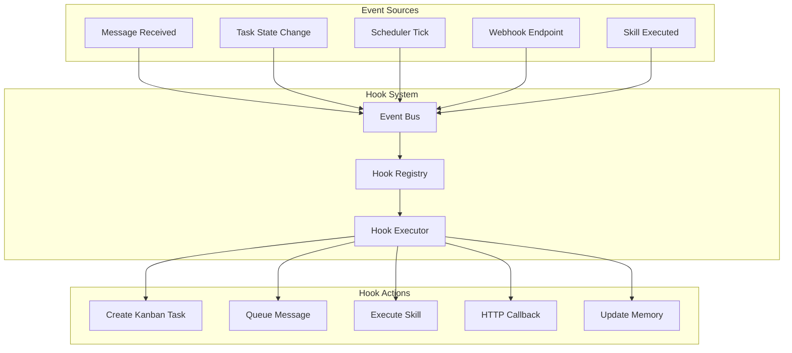

# Phase 11: Webhooks and Event Hooks

## Overview

Extend Botty's automation capabilities beyond cron jobs to a full event-driven system. This phase introduces hooks that can trigger on any system event (messages, approvals, skill executions) and webhooks for external integrations.

### Goals

- Create an event hook system with `IHook` interface
- Implement a hook registry for managing and triggering hooks
- Add webhook endpoints for external services (GitHub, Stripe, etc.)
- Integrate Gmail PubSub for real-time email notifications
- Enable hooks to be defined by users and plugins

### Non-Goals

- Visual workflow builder (future phase)
- Complex conditional logic (keep hooks simple)
- Guaranteed exactly-once delivery (at-least-once is acceptable)

## Architecture



## Interface Definitions

### IHook

```csharp
namespace Botty.Hooks;

public interface IHook
{
    string Id { get; }
    string Name { get; }
    string? Description { get; }
    
    // Trigger configuration
    HookTrigger Trigger { get; }
    HookCondition? Condition { get; }
    
    // Execution
    Task<HookResult> ExecuteAsync(HookContext context, CancellationToken ct = default);
    
    // Metadata
    bool IsEnabled { get; }
    string? CreatedBy { get; }  // "user", "assistant", plugin ID
}

public enum HookTrigger
{
    // Message events
    MessageReceived,          // Any incoming message
    MessageSent,              // After sending outbound message
    MessageFailed,            // Outbound message failed
    
    // Kanban events
    TaskCreated,              // New task added
    TaskMoved,                // Task changed lanes
    TaskApproved,             // User approved a task
    TaskRejected,             // User rejected a task
    TaskCompleted,            // Task moved to Done
    
    // Scheduler events
    ScheduleTrigger,          // Scheduled job fired
    
    // Skill events
    SkillExecuted,            // Skill completed
    SkillFailed,              // Skill threw error
    
    // Memory events
    MemoryCreated,            // New memory stored
    MemoryUpdated,            // Memory modified
    MemoryDeleted,            // Memory removed
    
    // System events
    SystemStartup,            // Application started
    SystemShutdown,           // Application stopping
    ChannelConnected,         // Messaging channel connected
    ChannelDisconnected,      // Messaging channel disconnected
    
    // External events
    WebhookReceived,          // Inbound webhook
    GmailNotification,        // Gmail PubSub push
    
    // Custom/plugin events
    Custom                    // Plugin-defined trigger
}
```

### HookCondition

```csharp
public class HookCondition
{
    // Simple property matching
    public Dictionary<string, string>? PropertyEquals { get; set; }
    public Dictionary<string, string>? PropertyContains { get; set; }
    public Dictionary<string, string>? PropertyMatches { get; set; }  // Regex
    
    // Logical operators
    public List<HookCondition>? And { get; set; }
    public List<HookCondition>? Or { get; set; }
    public HookCondition? Not { get; set; }
    
    public bool Evaluate(HookContext context)
    {
        if (PropertyEquals != null)
        {
            foreach (var (key, expected) in PropertyEquals)
            {
                var actual = context.GetProperty(key);
                if (actual != expected) return false;
            }
        }
        
        if (PropertyContains != null)
        {
            foreach (var (key, substring) in PropertyContains)
            {
                var actual = context.GetProperty(key);
                if (actual == null || !actual.Contains(substring)) return false;
            }
        }
        
        if (And != null && !And.All(c => c.Evaluate(context))) return false;
        if (Or != null && !Or.Any(c => c.Evaluate(context))) return false;
        if (Not != null && Not.Evaluate(context)) return false;
        
        return true;
    }
}
```

### HookContext

```csharp
public class HookContext
{
    public required HookTrigger Trigger { get; init; }
    public required DateTime Timestamp { get; init; }
    public required JsonDocument Payload { get; init; }
    
    // Convenience accessors
    public string? ChannelId { get; init; }
    public string? MessageId { get; init; }
    public Guid? TaskId { get; init; }
    public string? UserId { get; init; }
    
    // Property access for conditions
    public string? GetProperty(string path)
    {
        var parts = path.Split('.');
        var current = Payload.RootElement;
        
        foreach (var part in parts)
        {
            if (current.TryGetProperty(part, out var next))
                current = next;
            else
                return null;
        }
        
        return current.GetString();
    }
}

public class HookResult
{
    public bool Success { get; init; }
    public string? Output { get; init; }
    public string? Error { get; init; }
    public TimeSpan Duration { get; init; }
    public Dictionary<string, object>? Metadata { get; init; }
}
```

### IHookRegistry

```csharp
public interface IHookRegistry
{
    // Registration
    void Register(IHook hook);
    void Unregister(string hookId);
    
    // Discovery
    IHook? GetHook(string hookId);
    IEnumerable<IHook> GetHooksForTrigger(HookTrigger trigger);
    IEnumerable<IHook> GetAllHooks();
    
    // Triggering
    Task<IEnumerable<HookResult>> TriggerAsync(
        HookTrigger trigger, 
        HookContext context, 
        CancellationToken ct = default);
    
    // Event bus integration
    Task PublishEventAsync(HookTrigger trigger, object payload, CancellationToken ct = default);
}
```

## Implementation Tasks

### Task 1: Create Botty.Hooks Project

**Files to create:**
- `botty/src/Botty.Hooks/Botty.Hooks.csproj`
- `botty/src/Botty.Hooks/IHook.cs`
- `botty/src/Botty.Hooks/IHookRegistry.cs`
- `botty/src/Botty.Hooks/Models/HookTrigger.cs`
- `botty/src/Botty.Hooks/Models/HookContext.cs`
- `botty/src/Botty.Hooks/Models/HookCondition.cs`
- `botty/src/Botty.Hooks/Models/HookResult.cs`
- `botty/src/Botty.Hooks/Registry/HookRegistry.cs`
- `botty/src/Botty.Hooks/Executor/HookExecutor.cs`

### Task 2: Implement Built-in Hook Actions

Create reusable action types that hooks can invoke:

**Files to create:**
- `botty/src/Botty.Hooks/Actions/IHookAction.cs`
- `botty/src/Botty.Hooks/Actions/CreateTaskAction.cs`
- `botty/src/Botty.Hooks/Actions/SendMessageAction.cs`
- `botty/src/Botty.Hooks/Actions/ExecuteSkillAction.cs`
- `botty/src/Botty.Hooks/Actions/HttpCallbackAction.cs`
- `botty/src/Botty.Hooks/Actions/UpdateMemoryAction.cs`

```csharp
public interface IHookAction
{
    string Type { get; }
    Task<ActionResult> ExecuteAsync(JsonDocument config, HookContext context, CancellationToken ct);
}

public class CreateTaskAction : IHookAction
{
    public string Type => "create_task";
    
    private readonly IKanbanService _kanbanService;
    
    public async Task<ActionResult> ExecuteAsync(JsonDocument config, HookContext context, CancellationToken ct)
    {
        var title = config.RootElement.GetProperty("title").GetString()!;
        var description = config.RootElement.TryGetProperty("description", out var desc) 
            ? desc.GetString() 
            : null;
        
        // Template substitution
        title = SubstituteVariables(title, context);
        description = description != null ? SubstituteVariables(description, context) : null;
        
        var task = await _kanbanService.CreateTaskAsync(new CreateTaskRequest
        {
            Title = title,
            Description = description,
            Assignee = TaskAssignee.Assistant,
            Type = TaskType.General
        }, ct);
        
        return new ActionResult { Success = true, Output = task.Id.ToString() };
    }
}
```

### Task 3: Implement Declarative Hook Definition

Allow hooks to be defined in JSON/YAML without code:

```csharp
public class DeclarativeHook : IHook
{
    public string Id { get; init; } = default!;
    public string Name { get; init; } = default!;
    public string? Description { get; init; }
    public HookTrigger Trigger { get; init; }
    public HookCondition? Condition { get; init; }
    public bool IsEnabled { get; set; } = true;
    public string? CreatedBy { get; init; }
    
    // Action configuration
    public required string ActionType { get; init; }
    public required JsonDocument ActionConfig { get; init; }
    
    private readonly IServiceProvider _services;
    
    public async Task<HookResult> ExecuteAsync(HookContext context, CancellationToken ct)
    {
        var action = _services.GetRequiredKeyedService<IHookAction>(ActionType);
        var result = await action.ExecuteAsync(ActionConfig, context, ct);
        
        return new HookResult
        {
            Success = result.Success,
            Output = result.Output,
            Error = result.Error
        };
    }
}
```

**Example hook definition (JSON):**
```json
{
  "id": "urgent-email-alert",
  "name": "Urgent Email Alert",
  "trigger": "GmailNotification",
  "condition": {
    "propertyContains": {
      "subject": "URGENT"
    }
  },
  "actionType": "create_task",
  "actionConfig": {
    "title": "Urgent email from {{sender}}",
    "description": "Subject: {{subject}}\n\nPlease review immediately.",
    "priority": "high"
  }
}
```

### Task 4: Add Webhook Endpoints

Create REST endpoints to receive external webhooks:

**Files to create:**
- `botty/src/Botty.Api/Controllers/WebhooksController.cs`

```csharp
[ApiController]
[Route("api/webhooks")]
public class WebhooksController : ControllerBase
{
    private readonly IHookRegistry _hookRegistry;
    private readonly ILogger<WebhooksController> _logger;
    
    // Generic webhook endpoint
    [HttpPost("{hookId}")]
    public async Task<IActionResult> ReceiveWebhook(
        string hookId, 
        [FromBody] JsonDocument payload,
        CancellationToken ct)
    {
        var hook = _hookRegistry.GetHook(hookId);
        if (hook == null)
            return NotFound($"Hook '{hookId}' not found");
        
        // Verify signature if configured
        if (!await VerifyWebhookSignatureAsync(hookId, Request))
            return Unauthorized("Invalid webhook signature");
        
        var context = new HookContext
        {
            Trigger = HookTrigger.WebhookReceived,
            Timestamp = DateTime.UtcNow,
            Payload = payload
        };
        
        var result = await hook.ExecuteAsync(context, ct);
        
        return result.Success ? Ok(result) : StatusCode(500, result);
    }
    
    // GitHub-specific endpoint
    [HttpPost("github")]
    public async Task<IActionResult> ReceiveGitHubWebhook(
        [FromHeader(Name = "X-GitHub-Event")] string eventType,
        [FromHeader(Name = "X-Hub-Signature-256")] string? signature,
        [FromBody] JsonDocument payload,
        CancellationToken ct)
    {
        // Verify GitHub signature
        // Route to appropriate hooks based on event type
    }
    
    // Stripe-specific endpoint
    [HttpPost("stripe")]
    public async Task<IActionResult> ReceiveStripeWebhook(...)
}
```

### Task 5: Implement Gmail PubSub Integration

Set up real-time Gmail notifications via Google Cloud Pub/Sub:

**Files to create:**
- `botty/src/Botty.Hooks/Gmail/GmailPubSubService.cs`
- `botty/src/Botty.Hooks/Gmail/GmailNotificationHandler.cs`

```csharp
public class GmailPubSubService : BackgroundService
{
    private readonly SubscriberClient _subscriber;
    private readonly IHookRegistry _hookRegistry;
    private readonly IGmailSkill _gmailSkill;
    
    protected override async Task ExecuteAsync(CancellationToken ct)
    {
        await _subscriber.StartAsync(async (message, cancellationToken) =>
        {
            var notification = JsonSerializer.Deserialize<GmailNotification>(
                message.Data.ToStringUtf8());
            
            // Fetch the actual email
            var email = await _gmailSkill.GetMessageAsync(
                notification.HistoryId, 
                cancellationToken);
            
            var context = new HookContext
            {
                Trigger = HookTrigger.GmailNotification,
                Timestamp = DateTime.UtcNow,
                Payload = JsonDocument.Parse(JsonSerializer.Serialize(new
                {
                    email.Subject,
                    email.From,
                    email.To,
                    email.Snippet,
                    email.Labels,
                    notification.HistoryId
                }))
            };
            
            await _hookRegistry.TriggerAsync(HookTrigger.GmailNotification, context, ct);
            
            return SubscriberClient.Reply.Ack;
        });
    }
}
```

### Task 6: Integrate with Existing Systems

Update existing services to publish events:

**Kanban Service:**
```csharp
public async Task<KanbanTask> MoveTaskAsync(Guid taskId, KanbanLane newLane, CancellationToken ct)
{
    var task = await _repository.GetByIdAsync(taskId, ct);
    var oldLane = task.Lane;
    
    task.Lane = newLane;
    await _repository.UpdateAsync(task, ct);
    
    // Publish event
    await _hookRegistry.PublishEventAsync(HookTrigger.TaskMoved, new
    {
        TaskId = taskId,
        OldLane = oldLane.ToString(),
        NewLane = newLane.ToString(),
        Task = task
    }, ct);
    
    // Special events for approval workflow
    if (newLane == KanbanLane.Done && oldLane == KanbanLane.NeedsApproval)
    {
        await _hookRegistry.PublishEventAsync(HookTrigger.TaskApproved, new
        {
            TaskId = taskId,
            Task = task
        }, ct);
    }
    
    return task;
}
```

### Task 7: Add Admin UI for Hooks

**Files to create/modify:**
- `admin-ui/src/app/hooks/page.tsx` - Hook list and management
- `admin-ui/src/components/hooks/hook-editor.tsx` - Create/edit hooks
- `admin-ui/src/components/hooks/hook-logs.tsx` - Execution history

**Features:**
- List all hooks with status and last execution
- Create new hooks via form or JSON
- Test hooks with sample payloads
- View execution logs and errors
- Enable/disable hooks

### Task 8: Add API Endpoints for Hook Management

```
GET    /api/hooks                    # List all hooks
POST   /api/hooks                    # Create hook
GET    /api/hooks/{id}               # Get hook details
PUT    /api/hooks/{id}               # Update hook
DELETE /api/hooks/{id}               # Delete hook
POST   /api/hooks/{id}/test          # Test with sample payload
POST   /api/hooks/{id}/enable        # Enable hook
POST   /api/hooks/{id}/disable       # Disable hook
GET    /api/hooks/{id}/logs          # Get execution logs
GET    /api/hooks/triggers           # List available triggers
```

## Database Changes

### Hooks Table

```sql
CREATE TABLE hooks (
    id UUID PRIMARY KEY DEFAULT gen_random_uuid(),
    name VARCHAR(255) NOT NULL,
    description TEXT,
    trigger VARCHAR(50) NOT NULL,
    condition JSONB,
    action_type VARCHAR(50) NOT NULL,
    action_config JSONB NOT NULL,
    is_enabled BOOLEAN NOT NULL DEFAULT true,
    created_by VARCHAR(100),
    created_at TIMESTAMPTZ NOT NULL DEFAULT NOW(),
    updated_at TIMESTAMPTZ NOT NULL DEFAULT NOW()
);

CREATE INDEX idx_hooks_trigger ON hooks(trigger) WHERE is_enabled = true;
```

### Hook Executions Table

```sql
CREATE TABLE hook_executions (
    id UUID PRIMARY KEY DEFAULT gen_random_uuid(),
    hook_id UUID NOT NULL REFERENCES hooks(id) ON DELETE CASCADE,
    trigger VARCHAR(50) NOT NULL,
    payload JSONB,
    success BOOLEAN NOT NULL,
    output TEXT,
    error TEXT,
    duration_ms INT NOT NULL,
    executed_at TIMESTAMPTZ NOT NULL DEFAULT NOW()
);

CREATE INDEX idx_hook_executions_hook_id ON hook_executions(hook_id);
CREATE INDEX idx_hook_executions_executed_at ON hook_executions(executed_at DESC);

-- Cleanup old logs (keep 30 days)
CREATE OR REPLACE FUNCTION cleanup_hook_executions()
RETURNS void AS $$
BEGIN
    DELETE FROM hook_executions WHERE executed_at < NOW() - INTERVAL '30 days';
END;
$$ LANGUAGE plpgsql;
```

### Webhook Secrets Table

```sql
CREATE TABLE webhook_configs (
    id UUID PRIMARY KEY DEFAULT gen_random_uuid(),
    hook_id UUID NOT NULL REFERENCES hooks(id) ON DELETE CASCADE,
    secret_key VARCHAR(255),  -- For signature verification
    allowed_ips TEXT[],       -- IP whitelist
    rate_limit INT,           -- Requests per minute
    created_at TIMESTAMPTZ NOT NULL DEFAULT NOW()
);
```

## Configuration

### appsettings.json

```json
{
  "Hooks": {
    "Enabled": true,
    "MaxConcurrentExecutions": 10,
    "DefaultTimeoutSeconds": 30,
    "RetryOnFailure": false,
    "LogRetentionDays": 30
  },
  
  "Webhooks": {
    "Enabled": true,
    "BaseUrl": "https://botty.example.com/api/webhooks",
    "DefaultRateLimit": 100,
    "SignatureVerification": true
  },
  
  "GmailPubSub": {
    "Enabled": true,
    "ProjectId": "your-gcp-project",
    "SubscriptionId": "botty-gmail-subscription",
    "TopicId": "botty-gmail-topic"
  }
}
```

## Testing Strategy

### Unit Tests

- Condition evaluation logic
- Variable substitution in templates
- Hook registry operations

### Integration Tests

- Webhook signature verification
- End-to-end hook execution
- Gmail PubSub message handling

### Manual Testing

1. Create webhook on GitHub repo, verify events trigger hooks
2. Set up Gmail watch, send test email, verify hook fires
3. Approve Kanban task, verify TaskApproved hooks run

## Dependencies

### NuGet Packages

| Package | Version | Purpose |
|---------|---------|---------|
| `Google.Cloud.PubSub.V1` | 3.x | Gmail PubSub integration |

### External Services

- Google Cloud Pub/Sub (for Gmail notifications)
- Gmail API watch setup

## Risks and Mitigations

| Risk | Impact | Mitigation |
|------|--------|------------|
| Hook infinite loops | System hang | Detect cycles, max depth limit |
| Webhook flooding | Resource exhaustion | Rate limiting per webhook |
| Slow hook execution | Event backlog | Timeouts, async execution |
| Sensitive data in logs | Security risk | Redact payloads in logs |

## Success Criteria

- [ ] Hooks can be created via Admin UI
- [ ] At least 5 trigger types working (Message, Task, Schedule, Webhook, Gmail)
- [ ] Webhook endpoints receive and process external requests
- [ ] Gmail PubSub delivers real-time email notifications
- [ ] Execution logs visible in Admin UI
- [ ] Existing cron jobs continue working
