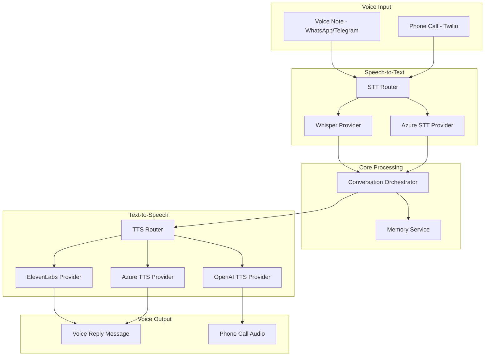

# Phase 13: Voice Capabilities

## Overview

Add speech-to-text (STT) and text-to-speech (TTS) capabilities to Botty, enabling voice interactions through messaging channels and optional phone call support. This phase focuses on processing voice notes from WhatsApp and other channels, and generating voice responses when appropriate.

### Goals

- Create `ISpeechToText` and `ITextToSpeech` interfaces
- Implement Whisper (OpenAI) provider for transcription
- Implement ElevenLabs and Azure providers for speech synthesis
- Process incoming voice notes from messaging channels
- Generate optional voice responses
- Add Twilio integration for phone calls (optional)

### Non-Goals

- Real-time voice streaming (WebRTC)
- Wake word detection (requires always-on audio)
- Voice cloning or custom voice training
- On-device processing (cloud APIs only)

## Architecture



## Interface Definitions

### ISpeechToText

```csharp
namespace Botty.Voice;

public interface ISpeechToText
{
    string ProviderId { get; }
    
    Task<TranscriptionResult> TranscribeAsync(
        Stream audioStream,
        TranscriptionOptions? options = null,
        CancellationToken ct = default);
    
    Task<TranscriptionResult> TranscribeFileAsync(
        string filePath,
        TranscriptionOptions? options = null,
        CancellationToken ct = default);
    
    IAsyncEnumerable<TranscriptionSegment> TranscribeStreamingAsync(
        Stream audioStream,
        TranscriptionOptions? options = null,
        CancellationToken ct = default);
}

public class TranscriptionOptions
{
    public string? Language { get; set; }        // ISO 639-1 code, e.g., "en", "es"
    public bool DetectLanguage { get; set; } = true;
    public string? Prompt { get; set; }          // Context hint for better accuracy
    public bool IncludeTimestamps { get; set; } = false;
    public bool IncludeWordTimestamps { get; set; } = false;
    public AudioFormat InputFormat { get; set; } = AudioFormat.Auto;
}

public class TranscriptionResult
{
    public required string Text { get; init; }
    public string? DetectedLanguage { get; init; }
    public float? Confidence { get; init; }
    public TimeSpan? Duration { get; init; }
    public List<TranscriptionSegment>? Segments { get; init; }
}

public class TranscriptionSegment
{
    public required string Text { get; init; }
    public TimeSpan Start { get; init; }
    public TimeSpan End { get; init; }
    public float? Confidence { get; init; }
    public List<WordTiming>? Words { get; init; }
}

public enum AudioFormat
{
    Auto,
    Wav,
    Mp3,
    Ogg,
    Webm,
    M4a,
    Flac
}
```

### ITextToSpeech

```csharp
public interface ITextToSpeech
{
    string ProviderId { get; }
    
    Task<SpeechResult> SynthesizeAsync(
        string text,
        SpeechOptions? options = null,
        CancellationToken ct = default);
    
    Task<Stream> SynthesizeToStreamAsync(
        string text,
        SpeechOptions? options = null,
        CancellationToken ct = default);
    
    IAsyncEnumerable<byte[]> SynthesizeStreamingAsync(
        string text,
        SpeechOptions? options = null,
        CancellationToken ct = default);
    
    Task<IEnumerable<VoiceInfo>> GetAvailableVoicesAsync(CancellationToken ct = default);
}

public class SpeechOptions
{
    public string? VoiceId { get; set; }
    public string? Language { get; set; }
    public float Speed { get; set; } = 1.0f;       // 0.5 - 2.0
    public float Pitch { get; set; } = 1.0f;       // 0.5 - 2.0
    public SpeechOutputFormat OutputFormat { get; set; } = SpeechOutputFormat.Mp3;
    public int? SampleRate { get; set; }           // 8000, 16000, 22050, 44100
    
    // ElevenLabs specific
    public float? Stability { get; set; }
    public float? SimilarityBoost { get; set; }
    public float? Style { get; set; }
}

public class SpeechResult
{
    public required byte[] AudioData { get; init; }
    public required string ContentType { get; init; }
    public TimeSpan Duration { get; init; }
    public int CharactersUsed { get; init; }
}

public class VoiceInfo
{
    public required string VoiceId { get; init; }
    public required string Name { get; init; }
    public string? Language { get; init; }
    public string? Gender { get; init; }
    public string? Description { get; init; }
    public string? PreviewUrl { get; init; }
    public bool IsCustom { get; init; }
}

public enum SpeechOutputFormat
{
    Mp3,
    Wav,
    Ogg,
    Flac,
    Pcm
}
```

### Voice Service

```csharp
public interface IVoiceService
{
    // High-level operations
    Task<string> ProcessVoiceNoteAsync(
        Stream audioStream,
        string channelId,
        string senderId,
        CancellationToken ct = default);
    
    Task<VoiceResponse> GenerateVoiceResponseAsync(
        string text,
        VoicePreferences? preferences = null,
        CancellationToken ct = default);
    
    // Configuration
    Task<VoicePreferences> GetUserPreferencesAsync(string userId, CancellationToken ct = default);
    Task SetUserPreferencesAsync(string userId, VoicePreferences preferences, CancellationToken ct = default);
}

public class VoicePreferences
{
    public bool PreferVoiceResponses { get; set; } = false;
    public string? PreferredVoiceId { get; set; }
    public string? PreferredLanguage { get; set; }
    public float Speed { get; set; } = 1.0f;
    public string PreferredTtsProvider { get; set; } = "openai";
}

public class VoiceResponse
{
    public required byte[] AudioData { get; init; }
    public required string ContentType { get; init; }
    public required string TextContent { get; init; }
    public TimeSpan Duration { get; init; }
}
```

## Implementation Tasks

### Task 1: Create Botty.Voice Project

**Files to create:**
- `botty/src/Botty.Voice/Botty.Voice.csproj`
- `botty/src/Botty.Voice/ISpeechToText.cs`
- `botty/src/Botty.Voice/ITextToSpeech.cs`
- `botty/src/Botty.Voice/IVoiceService.cs`
- `botty/src/Botty.Voice/Models/*.cs`

### Task 2: Implement Whisper Provider

**Files to create:**
- `botty/src/Botty.Voice/Providers/WhisperProvider.cs`
- `botty/src/Botty.Voice/Providers/WhisperOptions.cs`

```csharp
public class WhisperProvider : ISpeechToText
{
    public string ProviderId => "whisper";
    
    private readonly HttpClient _http;
    private readonly WhisperOptions _options;
    
    public async Task<TranscriptionResult> TranscribeAsync(
        Stream audioStream, 
        TranscriptionOptions? options = null,
        CancellationToken ct = default)
    {
        using var content = new MultipartFormDataContent();
        
        // Add audio file
        var audioContent = new StreamContent(audioStream);
        audioContent.Headers.ContentType = new MediaTypeHeaderValue(
            GetContentType(options?.InputFormat ?? AudioFormat.Auto));
        content.Add(audioContent, "file", "audio.mp3");
        
        // Add model
        content.Add(new StringContent(_options.Model), "model");
        
        // Add optional parameters
        if (options?.Language != null)
            content.Add(new StringContent(options.Language), "language");
        
        if (options?.Prompt != null)
            content.Add(new StringContent(options.Prompt), "prompt");
        
        if (options?.IncludeTimestamps == true)
            content.Add(new StringContent("verbose_json"), "response_format");
        
        var response = await _http.PostAsync(
            "https://api.openai.com/v1/audio/transcriptions",
            content,
            ct);
        
        response.EnsureSuccessStatusCode();
        
        var result = await response.Content.ReadFromJsonAsync<WhisperResponse>(ct);
        
        return new TranscriptionResult
        {
            Text = result!.Text,
            DetectedLanguage = result.Language,
            Duration = result.Duration != null 
                ? TimeSpan.FromSeconds(result.Duration.Value) 
                : null,
            Segments = result.Segments?.Select(s => new TranscriptionSegment
            {
                Text = s.Text,
                Start = TimeSpan.FromSeconds(s.Start),
                End = TimeSpan.FromSeconds(s.End),
                Confidence = s.AvgLogprob
            }).ToList()
        };
    }
}
```

### Task 3: Implement ElevenLabs Provider

**Files to create:**
- `botty/src/Botty.Voice/Providers/ElevenLabsProvider.cs`
- `botty/src/Botty.Voice/Providers/ElevenLabsOptions.cs`

```csharp
public class ElevenLabsProvider : ITextToSpeech
{
    public string ProviderId => "elevenlabs";
    
    private readonly HttpClient _http;
    private readonly ElevenLabsOptions _options;
    
    public async Task<SpeechResult> SynthesizeAsync(
        string text,
        SpeechOptions? options = null,
        CancellationToken ct = default)
    {
        var voiceId = options?.VoiceId ?? _options.DefaultVoiceId;
        var url = $"https://api.elevenlabs.io/v1/text-to-speech/{voiceId}";
        
        var requestBody = new
        {
            text,
            model_id = _options.ModelId,
            voice_settings = new
            {
                stability = options?.Stability ?? 0.5f,
                similarity_boost = options?.SimilarityBoost ?? 0.75f,
                style = options?.Style ?? 0.0f,
                use_speaker_boost = true
            }
        };
        
        var response = await _http.PostAsJsonAsync(url, requestBody, ct);
        response.EnsureSuccessStatusCode();
        
        var audioData = await response.Content.ReadAsByteArrayAsync(ct);
        
        return new SpeechResult
        {
            AudioData = audioData,
            ContentType = "audio/mpeg",
            CharactersUsed = text.Length
        };
    }
    
    public async Task<IEnumerable<VoiceInfo>> GetAvailableVoicesAsync(CancellationToken ct)
    {
        var response = await _http.GetAsync(
            "https://api.elevenlabs.io/v1/voices",
            ct);
        
        var result = await response.Content.ReadFromJsonAsync<ElevenLabsVoicesResponse>(ct);
        
        return result!.Voices.Select(v => new VoiceInfo
        {
            VoiceId = v.VoiceId,
            Name = v.Name,
            Description = v.Description,
            PreviewUrl = v.PreviewUrl,
            IsCustom = v.Category == "cloned"
        });
    }
}
```

### Task 4: Implement OpenAI TTS Provider

**Files to create:**
- `botty/src/Botty.Voice/Providers/OpenAiTtsProvider.cs`

```csharp
public class OpenAiTtsProvider : ITextToSpeech
{
    public string ProviderId => "openai";
    
    private readonly HttpClient _http;
    
    public async Task<SpeechResult> SynthesizeAsync(
        string text,
        SpeechOptions? options = null,
        CancellationToken ct = default)
    {
        var requestBody = new
        {
            model = "tts-1",  // or "tts-1-hd" for higher quality
            input = text,
            voice = options?.VoiceId ?? "nova",  // alloy, echo, fable, onyx, nova, shimmer
            response_format = options?.OutputFormat.ToString().ToLower() ?? "mp3",
            speed = options?.Speed ?? 1.0f
        };
        
        var response = await _http.PostAsJsonAsync(
            "https://api.openai.com/v1/audio/speech",
            requestBody,
            ct);
        
        response.EnsureSuccessStatusCode();
        
        var audioData = await response.Content.ReadAsByteArrayAsync(ct);
        
        return new SpeechResult
        {
            AudioData = audioData,
            ContentType = GetContentType(options?.OutputFormat ?? SpeechOutputFormat.Mp3),
            CharactersUsed = text.Length
        };
    }
    
    public Task<IEnumerable<VoiceInfo>> GetAvailableVoicesAsync(CancellationToken ct)
    {
        return Task.FromResult<IEnumerable<VoiceInfo>>(new[]
        {
            new VoiceInfo { VoiceId = "alloy", Name = "Alloy", Gender = "neutral" },
            new VoiceInfo { VoiceId = "echo", Name = "Echo", Gender = "male" },
            new VoiceInfo { VoiceId = "fable", Name = "Fable", Gender = "neutral" },
            new VoiceInfo { VoiceId = "onyx", Name = "Onyx", Gender = "male" },
            new VoiceInfo { VoiceId = "nova", Name = "Nova", Gender = "female" },
            new VoiceInfo { VoiceId = "shimmer", Name = "Shimmer", Gender = "female" },
        });
    }
}
```

### Task 5: Implement Azure Providers

**Files to create:**
- `botty/src/Botty.Voice/Providers/AzureSttProvider.cs`
- `botty/src/Botty.Voice/Providers/AzureTtsProvider.cs`

Azure Speech Services for enterprise customers with compliance requirements.

### Task 6: Implement Voice Service

**Files to create:**
- `botty/src/Botty.Voice/Services/VoiceService.cs`

```csharp
public class VoiceService : IVoiceService
{
    private readonly ISpeechToText _stt;
    private readonly ITextToSpeech _tts;
    private readonly IConversationOrchestrator _orchestrator;
    private readonly IMemoryService _memory;
    private readonly ILogger<VoiceService> _logger;
    
    public async Task<string> ProcessVoiceNoteAsync(
        Stream audioStream,
        string channelId,
        string senderId,
        CancellationToken ct)
    {
        _logger.LogInformation("Processing voice note from {Sender} on {Channel}", 
            senderId, channelId);
        
        // Transcribe
        var transcription = await _stt.TranscribeAsync(audioStream, new TranscriptionOptions
        {
            DetectLanguage = true,
            IncludeTimestamps = false
        }, ct);
        
        _logger.LogDebug("Transcribed: {Text} (language: {Lang})", 
            transcription.Text, transcription.DetectedLanguage);
        
        // Store original voice note info in memory
        await _memory.IngestAsync(new MemoryIngestionRequest
        {
            Content = $"[Voice note from {senderId}]: {transcription.Text}",
            Type = "episode",
            Source = $"voice:{channelId}",
            Metadata = new Dictionary<string, object>
            {
                ["original_format"] = "voice",
                ["detected_language"] = transcription.DetectedLanguage ?? "unknown",
                ["duration_seconds"] = transcription.Duration?.TotalSeconds ?? 0
            }
        }, ct);
        
        return transcription.Text;
    }
    
    public async Task<VoiceResponse> GenerateVoiceResponseAsync(
        string text,
        VoicePreferences? preferences = null,
        CancellationToken ct)
    {
        var options = new SpeechOptions
        {
            VoiceId = preferences?.PreferredVoiceId,
            Language = preferences?.PreferredLanguage,
            Speed = preferences?.Speed ?? 1.0f,
            OutputFormat = SpeechOutputFormat.Mp3
        };
        
        var result = await _tts.SynthesizeAsync(text, options, ct);
        
        return new VoiceResponse
        {
            AudioData = result.AudioData,
            ContentType = result.ContentType,
            TextContent = text,
            Duration = result.Duration
        };
    }
}
```

### Task 7: Integrate with Channel Plugins

Update channel plugins to handle voice notes:

```csharp
// In WhatsAppChannelPlugin
private async Task HandleIncomingMessage(WAWebJS.Message message)
{
    if (message.HasMedia && (message.Type == "audio" || message.Type == "ptt"))
    {
        // Download voice note
        var media = await message.DownloadMedia();
        using var audioStream = new MemoryStream(Convert.FromBase64String(media.Data));
        
        // Transcribe
        var text = await _voiceService.ProcessVoiceNoteAsync(
            audioStream, 
            Id, 
            message.From,
            ct);
        
        // Create message with transcription
        var incomingMessage = new IncomingMessage(
            MessageId: message.Id,
            ChatId: message.From,
            SenderId: message.Author ?? message.From,
            SenderName: message.NotifyName,
            Text: text,
            Timestamp: message.Timestamp,
            ChannelId: Id,
            Type: MessageType.Voice
        )
        {
            OriginalMediaType = media.Mimetype
        };
        
        OnMessageReceived(incomingMessage);
    }
}
```

### Task 8: Add Voice Response Option

Allow the assistant to respond with voice when appropriate:

```csharp
// In ConversationOrchestrator
public async Task<ConversationResponse> ProcessMessageAsync(
    ConversationRequest request,
    CancellationToken ct)
{
    // ... existing processing ...
    
    var response = await _llmProvider.CompleteAsync(llmRequest, ct);
    
    // Check if voice response is preferred
    var preferences = await _voiceService.GetUserPreferencesAsync(request.UserId, ct);
    
    if (preferences.PreferVoiceResponses && request.WasVoiceInput)
    {
        var voiceResponse = await _voiceService.GenerateVoiceResponseAsync(
            response.Content,
            preferences,
            ct);
        
        return new ConversationResponse
        {
            TextContent = response.Content,
            VoiceContent = voiceResponse.AudioData,
            VoiceContentType = voiceResponse.ContentType
        };
    }
    
    return new ConversationResponse { TextContent = response.Content };
}
```

### Task 9: Add Twilio Voice Call Support (Optional)

**Files to create:**
- `botty/src/Botty.Voice/Twilio/TwilioVoiceService.cs`
- `botty/src/Botty.Voice/Twilio/TwilioWebhookController.cs`

```csharp
public class TwilioVoiceService
{
    private readonly TwilioRestClient _client;
    private readonly IVoiceService _voiceService;
    private readonly IConversationOrchestrator _orchestrator;
    
    public async Task<CallResult> InitiateCallAsync(
        string toPhoneNumber,
        string initialMessage,
        CancellationToken ct)
    {
        // Generate initial TTS
        var speech = await _voiceService.GenerateVoiceResponseAsync(initialMessage, ct);
        
        // Upload to accessible URL or use TwiML
        var twiml = new VoiceResponse()
            .Say(initialMessage, voice: "Polly.Joanna")
            .Gather(
                input: new[] { Gather.InputEnum.Speech },
                action: new Uri($"{_baseUrl}/api/twilio/gather"),
                speechTimeout: "auto"
            );
        
        var call = await CallResource.CreateAsync(
            to: new PhoneNumber(toPhoneNumber),
            from: new PhoneNumber(_options.FromNumber),
            twiml: twiml,
            client: _client
        );
        
        return new CallResult { CallSid = call.Sid, Status = call.Status.ToString() };
    }
}

[ApiController]
[Route("api/twilio")]
public class TwilioWebhookController : ControllerBase
{
    [HttpPost("gather")]
    public async Task<IActionResult> HandleGather([FromForm] string SpeechResult, [FromForm] string CallSid)
    {
        // User spoke, process with Botty
        var response = await _orchestrator.ProcessMessageAsync(new ConversationRequest
        {
            Message = SpeechResult,
            ChannelId = "twilio",
            ConversationId = CallSid
        });
        
        // Respond with TTS
        var twiml = new VoiceResponse()
            .Say(response.TextContent, voice: "Polly.Joanna")
            .Gather(
                input: new[] { Gather.InputEnum.Speech },
                action: new Uri($"{_baseUrl}/api/twilio/gather"),
                speechTimeout: "auto"
            );
        
        return Content(twiml.ToString(), "application/xml");
    }
}
```

### Task 10: Add Admin UI for Voice Settings

**Files to create/modify:**
- `admin-ui/src/app/settings/voice/page.tsx`

Features:
- Select preferred TTS provider and voice
- Preview available voices
- Configure voice response preferences
- View voice usage statistics
- Twilio phone number configuration

## Database Changes

### Voice Preferences Table

```sql
CREATE TABLE voice_preferences (
    id UUID PRIMARY KEY DEFAULT gen_random_uuid(),
    user_id UUID NOT NULL UNIQUE,
    prefer_voice_responses BOOLEAN NOT NULL DEFAULT false,
    preferred_tts_provider VARCHAR(50),
    preferred_voice_id VARCHAR(100),
    preferred_language VARCHAR(10),
    speed DECIMAL(3,2) DEFAULT 1.0,
    created_at TIMESTAMPTZ NOT NULL DEFAULT NOW(),
    updated_at TIMESTAMPTZ NOT NULL DEFAULT NOW()
);
```

### Voice Usage Table

```sql
CREATE TABLE voice_usage (
    id UUID PRIMARY KEY DEFAULT gen_random_uuid(),
    user_id UUID,
    provider VARCHAR(50) NOT NULL,
    operation VARCHAR(20) NOT NULL,  -- 'stt' or 'tts'
    characters_or_seconds INT NOT NULL,
    cost_estimate DECIMAL(10,6),
    created_at TIMESTAMPTZ NOT NULL DEFAULT NOW()
);

CREATE INDEX idx_voice_usage_user ON voice_usage(user_id);
CREATE INDEX idx_voice_usage_date ON voice_usage(created_at);
```

## Configuration

### appsettings.json

```json
{
  "Voice": {
    "Enabled": true,
    
    "SpeechToText": {
      "DefaultProvider": "whisper",
      "Whisper": {
        "Model": "whisper-1"
      },
      "Azure": {
        "Region": "eastus"
      }
    },
    
    "TextToSpeech": {
      "DefaultProvider": "openai",
      "OpenAI": {
        "Model": "tts-1",
        "DefaultVoice": "nova"
      },
      "ElevenLabs": {
        "ModelId": "eleven_multilingual_v2",
        "DefaultVoiceId": "21m00Tcm4TlvDq8ikWAM"
      },
      "Azure": {
        "Region": "eastus",
        "DefaultVoice": "en-US-JennyNeural"
      }
    },
    
    "Twilio": {
      "Enabled": false,
      "FromNumber": "+1234567890"
    }
  }
}
```

### Secrets

| Secret Key | Description |
|------------|-------------|
| `voice_openai_api_key` | OpenAI API key (Whisper + TTS) |
| `voice_elevenlabs_api_key` | ElevenLabs API key |
| `voice_azure_key` | Azure Speech Services key |
| `voice_twilio_account_sid` | Twilio Account SID |
| `voice_twilio_auth_token` | Twilio Auth Token |

## Dependencies

### NuGet Packages

| Package | Version | Purpose |
|---------|---------|---------|
| `NAudio` | 2.x | Audio format conversion |
| `Twilio` | 7.x | Phone call support |
| `Microsoft.CognitiveServices.Speech` | 1.x | Azure Speech SDK |

## Testing Strategy

### Unit Tests

- Audio format detection
- Transcription result parsing
- TTS option mapping

### Integration Tests

- End-to-end transcription with test audio files
- TTS generation and validation
- Provider failover

### Manual Testing

1. Send voice note via WhatsApp
2. Verify transcription appears in conversation
3. Enable voice responses, verify audio reply
4. Test Twilio call flow (if enabled)

## Risks and Mitigations

| Risk | Impact | Mitigation |
|------|--------|------------|
| High API costs | Budget overrun | Usage tracking, limits, alerts |
| Audio quality issues | Poor transcription | Support multiple formats, preprocessing |
| Latency for long audio | Slow responses | Streaming transcription where possible |
| Language detection errors | Wrong transcription | Allow manual language hints |

## Success Criteria

- [ ] Voice notes from WhatsApp transcribed correctly
- [ ] At least 2 TTS providers working (OpenAI, ElevenLabs)
- [ ] Voice response toggle in user preferences
- [ ] Admin UI shows voice configuration
- [ ] Twilio phone calls working (if enabled)
- [ ] Usage tracking and cost estimates
