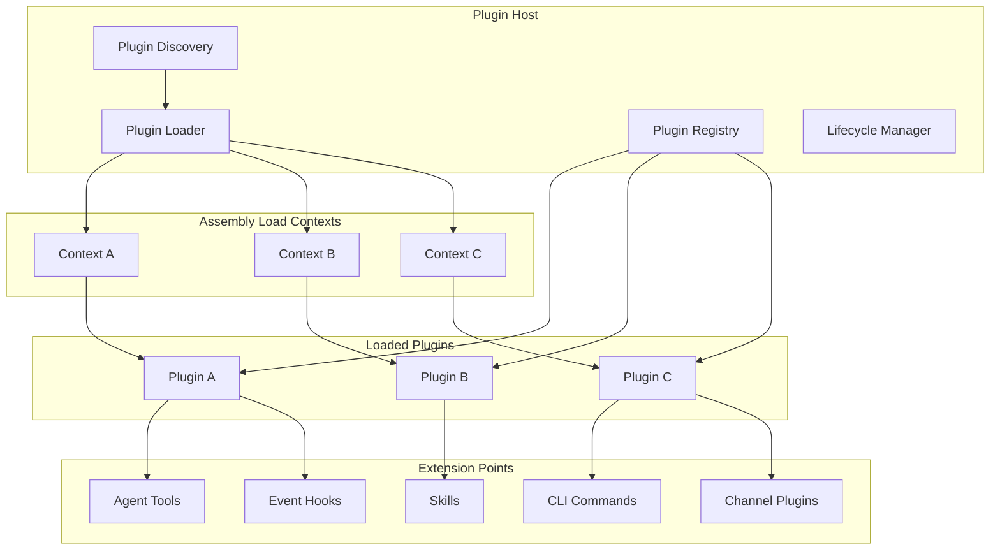

# Phase 14: Plugin Hot-Loading Runtime

## Overview

Create a runtime plugin system that allows Botty to load, unload, and reload plugins without recompilation. This enables community extensions, custom integrations, and the foundation for a plugin marketplace similar to OpenClaw's ClawHub.

### Goals

- Design plugin manifest format (`botty.plugin.json`)
- Implement plugin discovery and loading via `AssemblyLoadContext`
- Create plugin lifecycle management (install, enable, disable, unload, reload)
- Define plugin permission system for capability gating
- Build plugin API surface for tools, hooks, skills, and commands
- Add CLI and Admin UI for plugin management

### Non-Goals

- Full marketplace with payments (future)
- Plugin signing/verification (future)
- Sandboxed execution (plugins run in-process with trust)
- Cross-platform native plugins (C# only)

## Architecture



## Plugin Manifest

### botty.plugin.json

```json
{
  "$schema": "https://botty.dev/schemas/plugin-manifest.json",
  "id": "weather-alerts",
  "name": "Weather Alerts",
  "version": "1.0.0",
  "description": "Get weather alerts and forecasts via OpenWeatherMap",
  "author": {
    "name": "Community",
    "email": "plugins@botty.dev",
    "url": "https://github.com/botty-plugins/weather-alerts"
  },
  "license": "MIT",
  "repository": "https://github.com/botty-plugins/weather-alerts",
  
  "runtime": {
    "minBottyVersion": "1.0.0",
    "entryPoint": "WeatherAlerts.dll",
    "entryClass": "WeatherAlerts.Plugin"
  },
  
  "permissions": [
    "tools",
    "hooks",
    "http"
  ],
  
  "configSchema": {
    "type": "object",
    "properties": {
      "apiKey": {
        "type": "string",
        "description": "OpenWeatherMap API key",
        "sensitive": true
      },
      "defaultLocation": {
        "type": "string",
        "description": "Default location for weather queries"
      },
      "units": {
        "type": "string",
        "enum": ["metric", "imperial"],
        "default": "metric"
      }
    },
    "required": ["apiKey"]
  },
  
  "provides": {
    "tools": [
      {
        "name": "get_weather",
        "description": "Get current weather for a location"
      },
      {
        "name": "get_forecast",
        "description": "Get weather forecast"
      }
    ],
    "hooks": [
      {
        "trigger": "ScheduleTrigger",
        "name": "daily_weather_check"
      }
    ]
  },
  
  "dependencies": {
    "nuget": [
      "Newtonsoft.Json@13.0.3"
    ]
  }
}
```

## Interface Definitions

### IPlugin

```csharp
namespace Botty.Plugins;

public interface IPlugin : IAsyncDisposable
{
    // Identification
    string Id { get; }
    PluginManifest Manifest { get; }
    PluginState State { get; }
    
    // Lifecycle
    Task InitializeAsync(PluginContext context, CancellationToken ct = default);
    Task StartAsync(CancellationToken ct = default);
    Task StopAsync(CancellationToken ct = default);
    
    // Extension points
    IEnumerable<LlmTool> GetTools();
    IEnumerable<IHook> GetHooks();
    IEnumerable<ISkill> GetSkills();
    IEnumerable<CliCommand> GetCommands();
    IChannelPlugin? GetChannelPlugin();
    
    // Tool execution
    Task<ToolResult> ExecuteToolAsync(
        string toolName, 
        JsonDocument arguments, 
        CancellationToken ct = default);
}

public enum PluginState
{
    Unloaded,
    Loading,
    Loaded,
    Starting,
    Running,
    Stopping,
    Stopped,
    Failed
}

public class PluginContext
{
    public required IServiceProvider Services { get; init; }
    public required ILogger Logger { get; init; }
    public required IPluginConfigProvider Config { get; init; }
    public required ISecretStore Secrets { get; init; }
    public required PluginPermissions Permissions { get; init; }
}
```

### IPluginHost

```csharp
public interface IPluginHost
{
    // Discovery
    Task<IEnumerable<PluginManifest>> DiscoverPluginsAsync(CancellationToken ct = default);
    Task<IEnumerable<PluginManifest>> ScanDirectoryAsync(string path, CancellationToken ct = default);
    
    // Installation
    Task<PluginManifest> InstallFromPathAsync(string path, CancellationToken ct = default);
    Task<PluginManifest> InstallFromNuGetAsync(string packageId, string? version = null, CancellationToken ct = default);
    Task<PluginManifest> InstallFromUrlAsync(Uri url, CancellationToken ct = default);
    Task UninstallAsync(string pluginId, CancellationToken ct = default);
    
    // Lifecycle
    Task<IPlugin> LoadPluginAsync(string pluginId, CancellationToken ct = default);
    Task UnloadPluginAsync(string pluginId, CancellationToken ct = default);
    Task ReloadPluginAsync(string pluginId, CancellationToken ct = default);
    
    // Query
    IPlugin? GetPlugin(string pluginId);
    IEnumerable<IPlugin> GetLoadedPlugins();
    IEnumerable<PluginManifest> GetInstalledPlugins();
    PluginState GetState(string pluginId);
    
    // Aggregated extension points
    IEnumerable<LlmTool> GetAllTools();
    IEnumerable<IHook> GetAllHooks();
    Task<ToolResult> ExecuteToolAsync(string toolName, JsonDocument args, CancellationToken ct = default);
    
    // Events
    event EventHandler<PluginEventArgs> PluginLoaded;
    event EventHandler<PluginEventArgs> PluginUnloaded;
    event EventHandler<PluginErrorEventArgs> PluginFailed;
}
```

### Plugin Permissions

```csharp
[Flags]
public enum PluginPermissions
{
    None = 0,
    
    // Core capabilities
    Tools = 1 << 0,          // Register agent tools
    Hooks = 1 << 1,          // Register event hooks
    Skills = 1 << 2,         // Register skills
    Commands = 1 << 3,       // Register CLI commands
    Channels = 1 << 4,       // Register messaging channels
    
    // System access
    Http = 1 << 5,           // Make outbound HTTP requests
    FileSystem = 1 << 6,     // Read/write files (restricted paths)
    Shell = 1 << 7,          // Execute shell commands (dangerous)
    Database = 1 << 8,       // Direct database access
    
    // Botty services
    Memory = 1 << 9,         // Read/write memories
    Kanban = 1 << 10,        // Create/modify tasks
    Scheduler = 1 << 11,     // Create scheduled tasks
    Llm = 1 << 12,           // Make LLM requests
    Voice = 1 << 13,         // Use voice services
    
    // Composite
    SafeDefaults = Tools | Hooks | Http,
    All = ~None
}
```

## Implementation Tasks

### Task 1: Create Botty.Plugins Project

**Files to create:**
- `botty/src/Botty.Plugins/Botty.Plugins.csproj`
- `botty/src/Botty.Plugins/IPlugin.cs`
- `botty/src/Botty.Plugins/IPluginHost.cs`
- `botty/src/Botty.Plugins/Models/PluginManifest.cs`
- `botty/src/Botty.Plugins/Models/PluginState.cs`
- `botty/src/Botty.Plugins/Models/PluginPermissions.cs`

### Task 2: Implement Plugin Discovery

**Files to create:**
- `botty/src/Botty.Plugins/Discovery/PluginDiscovery.cs`
- `botty/src/Botty.Plugins/Discovery/ManifestParser.cs`

```csharp
public class PluginDiscovery
{
    private readonly ILogger<PluginDiscovery> _logger;
    
    public async Task<IEnumerable<PluginManifest>> DiscoverAsync(CancellationToken ct)
    {
        var manifests = new List<PluginManifest>();
        
        // 1. Built-in plugins (bundled with Botty)
        var builtInPath = Path.Combine(AppContext.BaseDirectory, "plugins");
        if (Directory.Exists(builtInPath))
            manifests.AddRange(await ScanDirectoryAsync(builtInPath, ct));
        
        // 2. User plugins (~/.botty/plugins)
        var userPath = Path.Combine(
            Environment.GetFolderPath(Environment.SpecialFolder.UserProfile),
            ".botty", "plugins");
        if (Directory.Exists(userPath))
            manifests.AddRange(await ScanDirectoryAsync(userPath, ct));
        
        // 3. Workspace plugins (.botty/plugins in current directory)
        var workspacePath = Path.Combine(Directory.GetCurrentDirectory(), ".botty", "plugins");
        if (Directory.Exists(workspacePath))
            manifests.AddRange(await ScanDirectoryAsync(workspacePath, ct));
        
        return manifests;
    }
    
    public async Task<IEnumerable<PluginManifest>> ScanDirectoryAsync(string path, CancellationToken ct)
    {
        var manifests = new List<PluginManifest>();
        
        foreach (var dir in Directory.GetDirectories(path))
        {
            var manifestPath = Path.Combine(dir, "botty.plugin.json");
            if (File.Exists(manifestPath))
            {
                try
                {
                    var json = await File.ReadAllTextAsync(manifestPath, ct);
                    var manifest = ManifestParser.Parse(json, dir);
                    manifests.Add(manifest);
                }
                catch (Exception ex)
                {
                    _logger.LogWarning(ex, "Failed to parse manifest at {Path}", manifestPath);
                }
            }
        }
        
        return manifests;
    }
}
```

### Task 3: Implement Plugin Loader with AssemblyLoadContext

**Files to create:**
- `botty/src/Botty.Plugins/Loading/PluginLoadContext.cs`
- `botty/src/Botty.Plugins/Loading/PluginLoader.cs`

```csharp
public class PluginLoadContext : AssemblyLoadContext
{
    private readonly AssemblyDependencyResolver _resolver;
    private readonly string _pluginPath;
    
    public PluginLoadContext(string pluginPath) : base(name: pluginPath, isCollectible: true)
    {
        _pluginPath = pluginPath;
        _resolver = new AssemblyDependencyResolver(pluginPath);
    }
    
    protected override Assembly? Load(AssemblyName assemblyName)
    {
        // Try to resolve from plugin directory first
        var assemblyPath = _resolver.ResolveAssemblyToPath(assemblyName);
        if (assemblyPath != null)
        {
            return LoadFromAssemblyPath(assemblyPath);
        }
        
        // Fall back to default context (shared assemblies)
        return null;
    }
    
    protected override IntPtr LoadUnmanagedDll(string unmanagedDllName)
    {
        var libraryPath = _resolver.ResolveUnmanagedDllToPath(unmanagedDllName);
        if (libraryPath != null)
        {
            return LoadUnmanagedDllFromPath(libraryPath);
        }
        
        return IntPtr.Zero;
    }
}

public class PluginLoader
{
    private readonly Dictionary<string, PluginLoadContext> _loadContexts = new();
    private readonly Dictionary<string, IPlugin> _loadedPlugins = new();
    private readonly IServiceProvider _services;
    private readonly ILogger<PluginLoader> _logger;
    
    public async Task<IPlugin> LoadAsync(PluginManifest manifest, CancellationToken ct)
    {
        if (_loadedPlugins.ContainsKey(manifest.Id))
            throw new InvalidOperationException($"Plugin {manifest.Id} is already loaded");
        
        var entryPointPath = Path.Combine(manifest.BasePath, manifest.Runtime.EntryPoint);
        
        // Create isolated load context
        var loadContext = new PluginLoadContext(entryPointPath);
        _loadContexts[manifest.Id] = loadContext;
        
        // Load assembly
        var assembly = loadContext.LoadFromAssemblyPath(entryPointPath);
        
        // Find entry class
        var pluginType = assembly.GetType(manifest.Runtime.EntryClass)
            ?? throw new InvalidOperationException(
                $"Entry class {manifest.Runtime.EntryClass} not found");
        
        // Instantiate plugin
        var plugin = (IPlugin)Activator.CreateInstance(pluginType)!;
        
        // Initialize with context
        var context = CreatePluginContext(manifest);
        await plugin.InitializeAsync(context, ct);
        
        _loadedPlugins[manifest.Id] = plugin;
        _logger.LogInformation("Loaded plugin: {Id} v{Version}", manifest.Id, manifest.Version);
        
        return plugin;
    }
    
    public async Task UnloadAsync(string pluginId, CancellationToken ct)
    {
        if (!_loadedPlugins.TryGetValue(pluginId, out var plugin))
            return;
        
        // Stop and dispose plugin
        await plugin.StopAsync(ct);
        await plugin.DisposeAsync();
        
        _loadedPlugins.Remove(pluginId);
        
        // Unload assembly context
        if (_loadContexts.TryGetValue(pluginId, out var context))
        {
            _loadContexts.Remove(pluginId);
            context.Unload();
            
            // Force GC to actually unload
            for (int i = 0; i < 10 && context.IsAlive(); i++)
            {
                GC.Collect();
                GC.WaitForPendingFinalizers();
            }
        }
        
        _logger.LogInformation("Unloaded plugin: {Id}", pluginId);
    }
    
    public async Task ReloadAsync(string pluginId, CancellationToken ct)
    {
        var manifest = GetManifest(pluginId);
        await UnloadAsync(pluginId, ct);
        await LoadAsync(manifest, ct);
    }
}
```

### Task 4: Implement Plugin Host

**Files to create:**
- `botty/src/Botty.Plugins/Host/PluginHost.cs`

```csharp
public class PluginHost : IPluginHost, IAsyncDisposable
{
    private readonly PluginDiscovery _discovery;
    private readonly PluginLoader _loader;
    private readonly PluginInstaller _installer;
    private readonly ILogger<PluginHost> _logger;
    
    private readonly Dictionary<string, PluginManifest> _installedPlugins = new();
    private readonly Dictionary<string, IPlugin> _runningPlugins = new();
    
    public event EventHandler<PluginEventArgs>? PluginLoaded;
    public event EventHandler<PluginEventArgs>? PluginUnloaded;
    public event EventHandler<PluginErrorEventArgs>? PluginFailed;
    
    public async Task InitializeAsync(CancellationToken ct)
    {
        // Discover installed plugins
        var manifests = await _discovery.DiscoverAsync(ct);
        foreach (var manifest in manifests)
        {
            _installedPlugins[manifest.Id] = manifest;
        }
        
        // Auto-load enabled plugins
        foreach (var manifest in manifests.Where(m => m.AutoLoad))
        {
            try
            {
                await LoadPluginAsync(manifest.Id, ct);
            }
            catch (Exception ex)
            {
                _logger.LogError(ex, "Failed to auto-load plugin {Id}", manifest.Id);
                PluginFailed?.Invoke(this, new PluginErrorEventArgs(manifest.Id, ex));
            }
        }
    }
    
    public async Task<IPlugin> LoadPluginAsync(string pluginId, CancellationToken ct)
    {
        if (!_installedPlugins.TryGetValue(pluginId, out var manifest))
            throw new PluginNotFoundException(pluginId);
        
        var plugin = await _loader.LoadAsync(manifest, ct);
        await plugin.StartAsync(ct);
        
        _runningPlugins[pluginId] = plugin;
        PluginLoaded?.Invoke(this, new PluginEventArgs(pluginId, manifest));
        
        return plugin;
    }
    
    public IEnumerable<LlmTool> GetAllTools()
    {
        return _runningPlugins.Values
            .SelectMany(p => p.GetTools())
            .ToList();
    }
    
    public async Task<ToolResult> ExecuteToolAsync(string toolName, JsonDocument args, CancellationToken ct)
    {
        foreach (var plugin in _runningPlugins.Values)
        {
            var tool = plugin.GetTools().FirstOrDefault(t => t.Name == toolName);
            if (tool != null)
            {
                return await plugin.ExecuteToolAsync(toolName, args, ct);
            }
        }
        
        throw new ToolNotFoundException(toolName);
    }
}
```

### Task 5: Implement Plugin Base Class

**Files to create:**
- `botty/src/Botty.Plugins/Base/PluginBase.cs`

```csharp
public abstract class PluginBase : IPlugin
{
    public abstract string Id { get; }
    public PluginManifest Manifest { get; private set; } = default!;
    public PluginState State { get; private set; } = PluginState.Unloaded;
    
    protected PluginContext Context { get; private set; } = default!;
    protected ILogger Logger => Context.Logger;
    protected IPluginConfigProvider Config => Context.Config;
    
    public virtual async Task InitializeAsync(PluginContext context, CancellationToken ct)
    {
        Context = context;
        State = PluginState.Loaded;
        await OnInitializeAsync(ct);
    }
    
    public virtual async Task StartAsync(CancellationToken ct)
    {
        State = PluginState.Starting;
        await OnStartAsync(ct);
        State = PluginState.Running;
    }
    
    public virtual async Task StopAsync(CancellationToken ct)
    {
        State = PluginState.Stopping;
        await OnStopAsync(ct);
        State = PluginState.Stopped;
    }
    
    public virtual async ValueTask DisposeAsync()
    {
        await OnDisposeAsync();
        State = PluginState.Unloaded;
    }
    
    // Override these in plugin implementations
    protected virtual Task OnInitializeAsync(CancellationToken ct) => Task.CompletedTask;
    protected virtual Task OnStartAsync(CancellationToken ct) => Task.CompletedTask;
    protected virtual Task OnStopAsync(CancellationToken ct) => Task.CompletedTask;
    protected virtual Task OnDisposeAsync() => Task.CompletedTask;
    
    // Extension points - override to provide
    public virtual IEnumerable<LlmTool> GetTools() => Enumerable.Empty<LlmTool>();
    public virtual IEnumerable<IHook> GetHooks() => Enumerable.Empty<IHook>();
    public virtual IEnumerable<ISkill> GetSkills() => Enumerable.Empty<ISkill>();
    public virtual IEnumerable<CliCommand> GetCommands() => Enumerable.Empty<CliCommand>();
    public virtual IChannelPlugin? GetChannelPlugin() => null;
    
    public virtual Task<ToolResult> ExecuteToolAsync(
        string toolName, 
        JsonDocument arguments, 
        CancellationToken ct)
    {
        throw new NotImplementedException($"Tool {toolName} not implemented");
    }
}
```

### Task 6: Implement Plugin Installer

**Files to create:**
- `botty/src/Botty.Plugins/Installation/PluginInstaller.cs`

```csharp
public class PluginInstaller
{
    private readonly string _pluginsPath;
    private readonly HttpClient _http;
    private readonly ILogger<PluginInstaller> _logger;
    
    public async Task<PluginManifest> InstallFromPathAsync(string sourcePath, CancellationToken ct)
    {
        var manifestPath = Path.Combine(sourcePath, "botty.plugin.json");
        if (!File.Exists(manifestPath))
            throw new InvalidOperationException("No botty.plugin.json found");
        
        var manifest = await ManifestParser.ParseFileAsync(manifestPath, ct);
        var targetPath = Path.Combine(_pluginsPath, manifest.Id);
        
        // Copy plugin files
        if (Directory.Exists(targetPath))
            Directory.Delete(targetPath, recursive: true);
        
        CopyDirectory(sourcePath, targetPath);
        
        _logger.LogInformation("Installed plugin {Id} from {Path}", manifest.Id, sourcePath);
        
        return manifest with { BasePath = targetPath };
    }
    
    public async Task<PluginManifest> InstallFromNuGetAsync(
        string packageId, 
        string? version = null,
        CancellationToken ct = default)
    {
        // Use NuGet client to download and extract package
        var packagePath = await DownloadNuGetPackageAsync(packageId, version, ct);
        return await InstallFromPathAsync(packagePath, ct);
    }
    
    public async Task<PluginManifest> InstallFromUrlAsync(Uri url, CancellationToken ct)
    {
        // Download zip/tarball
        var tempPath = Path.GetTempFileName();
        await using var stream = await _http.GetStreamAsync(url, ct);
        await using var fileStream = File.Create(tempPath);
        await stream.CopyToAsync(fileStream, ct);
        
        // Extract
        var extractPath = Path.Combine(Path.GetTempPath(), Guid.NewGuid().ToString());
        ZipFile.ExtractToDirectory(tempPath, extractPath);
        
        // Install
        return await InstallFromPathAsync(extractPath, ct);
    }
    
    public async Task UninstallAsync(string pluginId, CancellationToken ct)
    {
        var pluginPath = Path.Combine(_pluginsPath, pluginId);
        if (Directory.Exists(pluginPath))
        {
            Directory.Delete(pluginPath, recursive: true);
            _logger.LogInformation("Uninstalled plugin {Id}", pluginId);
        }
    }
}
```

### Task 7: Create Example Plugin

**Files to create in separate project:**
- `plugins/weather-alerts/botty.plugin.json`
- `plugins/weather-alerts/WeatherAlerts.csproj`
- `plugins/weather-alerts/Plugin.cs`

```csharp
namespace WeatherAlerts;

public class Plugin : PluginBase
{
    public override string Id => "weather-alerts";
    
    private HttpClient _http = default!;
    private string _apiKey = default!;
    
    protected override async Task OnInitializeAsync(CancellationToken ct)
    {
        _apiKey = await Config.GetSecretAsync("apiKey", ct) 
            ?? throw new InvalidOperationException("API key not configured");
        
        _http = new HttpClient
        {
            BaseAddress = new Uri("https://api.openweathermap.org/data/2.5/")
        };
    }
    
    public override IEnumerable<LlmTool> GetTools()
    {
        yield return new LlmTool
        {
            Name = "get_weather",
            Description = "Get current weather for a location",
            ParametersSchema = """
            {
                "type": "object",
                "properties": {
                    "location": { "type": "string", "description": "City name or coordinates" }
                },
                "required": ["location"]
            }
            """
        };
    }
    
    public override async Task<ToolResult> ExecuteToolAsync(
        string toolName, 
        JsonDocument arguments, 
        CancellationToken ct)
    {
        if (toolName == "get_weather")
        {
            var location = arguments.RootElement.GetProperty("location").GetString();
            var response = await _http.GetStringAsync(
                $"weather?q={location}&appid={_apiKey}&units=metric", ct);
            
            return new ToolResult { Success = true, Output = response };
        }
        
        return new ToolResult { Success = false, Error = $"Unknown tool: {toolName}" };
    }
}
```

### Task 8: Integrate with LLM and Hooks

Update the LLM provider and hook registry to include plugin-provided tools and hooks:

```csharp
// In ConversationOrchestrator
private IEnumerable<LlmTool> GetAllAvailableTools()
{
    var tools = new List<LlmTool>();
    
    // Built-in skill tools
    tools.AddRange(_skillRegistry.GetAllTools());
    
    // Plugin tools
    tools.AddRange(_pluginHost.GetAllTools());
    
    return tools;
}
```

### Task 9: Add CLI Commands

Add plugin management commands to the CLI:

```bash
botty plugins list                  # List installed plugins
botty plugins show <id>             # Show plugin details
botty plugins install <path|url>    # Install plugin
botty plugins uninstall <id>        # Remove plugin
botty plugins enable <id>           # Enable and load plugin
botty plugins disable <id>          # Stop and disable plugin
botty plugins reload <id>           # Hot-reload plugin
```

### Task 10: Add Admin UI

**Files to create/modify:**
- `admin-ui/src/app/plugins/page.tsx`
- `admin-ui/src/components/plugins/plugin-card.tsx`
- `admin-ui/src/components/plugins/plugin-config.tsx`

Features:
- List installed plugins with status
- Enable/disable plugins
- Configure plugin settings
- View plugin tools and hooks
- Install from file upload or URL

## Database Changes

### Plugin State Table

```sql
CREATE TABLE plugin_states (
    id UUID PRIMARY KEY DEFAULT gen_random_uuid(),
    plugin_id VARCHAR(100) NOT NULL UNIQUE,
    is_enabled BOOLEAN NOT NULL DEFAULT false,
    config JSONB NOT NULL DEFAULT '{}',
    installed_at TIMESTAMPTZ NOT NULL DEFAULT NOW(),
    last_loaded_at TIMESTAMPTZ,
    last_error TEXT
);
```

## Configuration

### Plugin Paths

```json
{
  "Plugins": {
    "Enabled": true,
    "Paths": [
      "~/.botty/plugins",
      "/opt/botty/plugins"
    ],
    "AutoLoadEnabled": ["weather-alerts", "custom-hooks"],
    "Permissions": {
      "Default": ["Tools", "Hooks", "Http"],
      "AllowDangerous": false
    }
  }
}
```

## Security Considerations

1. **Trust Model**: Plugins run in-process with full access. Only install trusted plugins.
2. **Permissions**: Gate dangerous capabilities (Shell, FileSystem, Database) behind explicit permissions.
3. **Code Review**: Recommended for third-party plugins.
4. **Future**: Plugin signing and verification for marketplace distribution.

## Dependencies

### NuGet Packages

| Package | Version | Purpose |
|---------|---------|---------|
| `NuGet.Protocol` | 6.x | NuGet package installation |
| `System.Runtime.Loader` | (built-in) | AssemblyLoadContext |

## Success Criteria

- [ ] Plugins can be loaded and unloaded at runtime
- [ ] Hot-reload works without restarting Botty
- [ ] Plugin tools appear in LLM tool list
- [ ] Plugin hooks integrate with hook system
- [ ] CLI and Admin UI can manage plugins
- [ ] Example weather plugin works end-to-end
