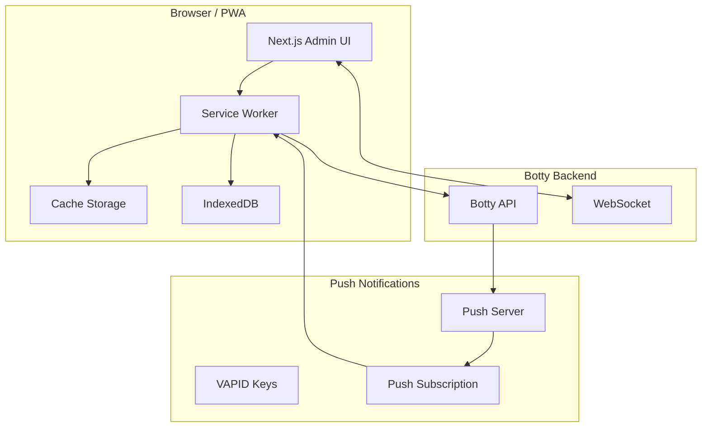
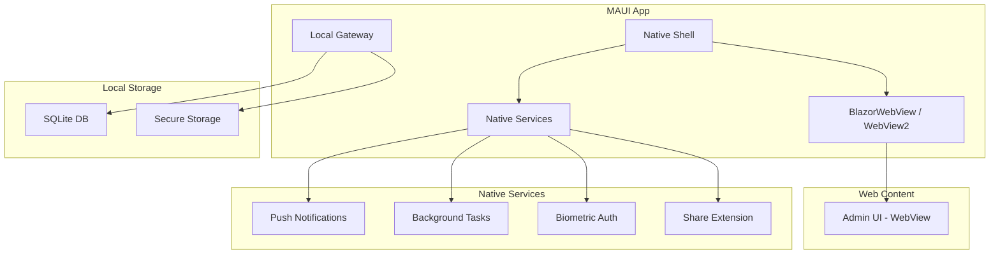

# Phase 15: PWA and Native Applications

## Overview

Extend Botty's reach beyond the web Admin UI to native mobile and desktop applications. This phase prioritizes a Progressive Web App (PWA) approach for broad compatibility, with optional .NET MAUI hybrid apps for deeper platform integration.

### Goals

- Convert Admin UI to a full Progressive Web App with offline support
- Implement push notifications for task approvals and messages
- Create .NET MAUI hybrid app shells for iOS, Android, macOS, Windows
- Design local Gateway service architecture for desktop
- Implement offline-first data synchronization

### Non-Goals

- Fully native UI (use WebView with native shell)
- Apple Watch / Wear OS apps
- CarPlay / Android Auto integration
- Voice assistant integration (Siri, Google Assistant)

## Architecture

### PWA Architecture



### MAUI Hybrid Architecture



## PWA Implementation

### Task 1: Add Service Worker

**Files to create/modify:**
- `admin-ui/public/sw.js`
- `admin-ui/src/lib/pwa.ts`
- `admin-ui/next.config.ts`

```javascript
// admin-ui/public/sw.js
const CACHE_NAME = 'botty-v1';
const STATIC_ASSETS = [
  '/',
  '/kanban',
  '/soul',
  '/skills',
  '/memory',
  '/scheduler',
  '/settings',
  '/offline.html'
];

// Install - cache static assets
self.addEventListener('install', (event) => {
  event.waitUntil(
    caches.open(CACHE_NAME).then((cache) => {
      return cache.addAll(STATIC_ASSETS);
    })
  );
  self.skipWaiting();
});

// Activate - clean old caches
self.addEventListener('activate', (event) => {
  event.waitUntil(
    caches.keys().then((keys) => {
      return Promise.all(
        keys.filter((key) => key !== CACHE_NAME)
            .map((key) => caches.delete(key))
      );
    })
  );
  self.clients.claim();
});

// Fetch - network first, cache fallback
self.addEventListener('fetch', (event) => {
  const { request } = event;
  
  // API requests - network only, queue if offline
  if (request.url.includes('/api/')) {
    event.respondWith(
      fetch(request).catch(() => {
        // Queue for later sync
        return queueRequest(request);
      })
    );
    return;
  }
  
  // Static assets - cache first
  event.respondWith(
    caches.match(request).then((cached) => {
      return cached || fetch(request).then((response) => {
        const clone = response.clone();
        caches.open(CACHE_NAME).then((cache) => {
          cache.put(request, clone);
        });
        return response;
      });
    }).catch(() => {
      // Offline fallback
      if (request.mode === 'navigate') {
        return caches.match('/offline.html');
      }
    })
  );
});

// Push notifications
self.addEventListener('push', (event) => {
  const data = event.data?.json() ?? {};
  
  const options = {
    body: data.body,
    icon: '/icon-192.png',
    badge: '/badge.png',
    tag: data.tag || 'botty-notification',
    data: data.data,
    actions: data.actions || []
  };
  
  event.waitUntil(
    self.registration.showNotification(data.title || 'Botty', options)
  );
});

// Notification click
self.addEventListener('notificationclick', (event) => {
  event.notification.close();
  
  const action = event.action;
  const data = event.notification.data;
  
  if (action === 'approve' && data?.taskId) {
    // Quick approve action
    event.waitUntil(
      fetch(`/api/tasks/${data.taskId}/approve`, { method: 'POST' })
    );
    return;
  }
  
  // Open app to relevant page
  const url = data?.url || '/';
  event.waitUntil(
    clients.openWindow(url)
  );
});

// Background sync
self.addEventListener('sync', (event) => {
  if (event.tag === 'sync-queue') {
    event.waitUntil(syncQueuedRequests());
  }
});
```

### Task 2: Add Web App Manifest

**Files to create:**
- `admin-ui/public/manifest.json`

```json
{
  "name": "Botty AI Assistant",
  "short_name": "Botty",
  "description": "Personal AI assistant with approval workflows",
  "start_url": "/",
  "display": "standalone",
  "background_color": "#1a1a1a",
  "theme_color": "#3b82f6",
  "orientation": "any",
  "icons": [
    {
      "src": "/icon-192.png",
      "sizes": "192x192",
      "type": "image/png",
      "purpose": "any maskable"
    },
    {
      "src": "/icon-512.png",
      "sizes": "512x512",
      "type": "image/png",
      "purpose": "any maskable"
    }
  ],
  "screenshots": [
    {
      "src": "/screenshot-wide.png",
      "sizes": "1280x720",
      "type": "image/png",
      "form_factor": "wide"
    },
    {
      "src": "/screenshot-narrow.png",
      "sizes": "750x1334",
      "type": "image/png",
      "form_factor": "narrow"
    }
  ],
  "shortcuts": [
    {
      "name": "Approvals",
      "url": "/kanban?lane=needs-approval",
      "icons": [{ "src": "/shortcut-approvals.png", "sizes": "96x96" }]
    },
    {
      "name": "Chat",
      "url": "/chat",
      "icons": [{ "src": "/shortcut-chat.png", "sizes": "96x96" }]
    }
  ],
  "share_target": {
    "action": "/share",
    "method": "POST",
    "enctype": "multipart/form-data",
    "params": {
      "title": "title",
      "text": "text",
      "url": "url"
    }
  }
}
```

### Task 3: Implement Push Notifications

**Backend - Push subscription management:**

```csharp
// botty/src/Botty.Api/Controllers/PushController.cs
[ApiController]
[Route("api/push")]
public class PushController : ControllerBase
{
    private readonly IPushNotificationService _pushService;
    
    [HttpPost("subscribe")]
    public async Task<IActionResult> Subscribe([FromBody] PushSubscription subscription)
    {
        await _pushService.SubscribeAsync(subscription);
        return Ok();
    }
    
    [HttpDelete("unsubscribe")]
    public async Task<IActionResult> Unsubscribe([FromBody] PushSubscription subscription)
    {
        await _pushService.UnsubscribeAsync(subscription.Endpoint);
        return Ok();
    }
}

// botty/src/Botty.Api/Services/PushNotificationService.cs
public class PushNotificationService : IPushNotificationService
{
    private readonly VapidDetails _vapidDetails;
    private readonly IPushSubscriptionRepository _repository;
    
    public async Task SendAsync(string userId, PushPayload payload)
    {
        var subscriptions = await _repository.GetByUserIdAsync(userId);
        
        foreach (var subscription in subscriptions)
        {
            try
            {
                var webPushClient = new WebPushClient();
                await webPushClient.SendNotificationAsync(
                    subscription.ToWebPushSubscription(),
                    JsonSerializer.Serialize(payload),
                    _vapidDetails
                );
            }
            catch (WebPushException ex) when (ex.StatusCode == HttpStatusCode.Gone)
            {
                // Subscription expired
                await _repository.DeleteAsync(subscription.Endpoint);
            }
        }
    }
    
    public async Task NotifyTaskNeedsApprovalAsync(KanbanTask task)
    {
        await SendAsync(task.AssignedToUserId, new PushPayload
        {
            Title = "Task Needs Approval",
            Body = task.Title,
            Tag = $"task-{task.Id}",
            Data = new { taskId = task.Id, url = $"/kanban?task={task.Id}" },
            Actions = new[]
            {
                new PushAction { Action = "approve", Title = "Approve" },
                new PushAction { Action = "view", Title = "View" }
            }
        });
    }
}
```

**Frontend - Push subscription:**

```typescript
// admin-ui/src/lib/push.ts
export async function subscribeToPush(): Promise<void> {
  if (!('serviceWorker' in navigator) || !('PushManager' in window)) {
    console.warn('Push notifications not supported');
    return;
  }
  
  const registration = await navigator.serviceWorker.ready;
  
  // Check existing subscription
  let subscription = await registration.pushManager.getSubscription();
  
  if (!subscription) {
    // Get VAPID public key from server
    const response = await fetch('/api/push/vapid-public-key');
    const { publicKey } = await response.json();
    
    subscription = await registration.pushManager.subscribe({
      userVisibleOnly: true,
      applicationServerKey: urlBase64ToUint8Array(publicKey)
    });
  }
  
  // Send subscription to server
  await fetch('/api/push/subscribe', {
    method: 'POST',
    headers: { 'Content-Type': 'application/json' },
    body: JSON.stringify(subscription.toJSON())
  });
}
```

### Task 4: Implement Offline Data Sync

**Files to create:**
- `admin-ui/src/lib/offline-store.ts`
- `admin-ui/src/lib/sync.ts`

```typescript
// admin-ui/src/lib/offline-store.ts
import { openDB, DBSchema, IDBPDatabase } from 'idb';

interface BottyDB extends DBSchema {
  tasks: {
    key: string;
    value: KanbanTask;
    indexes: { 'by-lane': string };
  };
  memories: {
    key: string;
    value: Memory;
  };
  pendingActions: {
    key: number;
    value: PendingAction;
  };
}

let db: IDBPDatabase<BottyDB>;

export async function initDB(): Promise<void> {
  db = await openDB<BottyDB>('botty-offline', 1, {
    upgrade(db) {
      const taskStore = db.createObjectStore('tasks', { keyPath: 'id' });
      taskStore.createIndex('by-lane', 'lane');
      
      db.createObjectStore('memories', { keyPath: 'id' });
      db.createObjectStore('pendingActions', { autoIncrement: true });
    }
  });
}

export async function cacheTasks(tasks: KanbanTask[]): Promise<void> {
  const tx = db.transaction('tasks', 'readwrite');
  await Promise.all(tasks.map(task => tx.store.put(task)));
  await tx.done;
}

export async function getCachedTasks(lane?: string): Promise<KanbanTask[]> {
  if (lane) {
    return db.getAllFromIndex('tasks', 'by-lane', lane);
  }
  return db.getAll('tasks');
}

export async function queueAction(action: PendingAction): Promise<void> {
  await db.add('pendingActions', action);
  
  // Request background sync
  const registration = await navigator.serviceWorker.ready;
  await registration.sync.register('sync-queue');
}

export async function getPendingActions(): Promise<PendingAction[]> {
  return db.getAll('pendingActions');
}

export async function clearPendingAction(key: number): Promise<void> {
  await db.delete('pendingActions', key);
}
```

```typescript
// admin-ui/src/lib/sync.ts
export async function syncQueuedRequests(): Promise<void> {
  const actions = await getPendingActions();
  
  for (const action of actions) {
    try {
      const response = await fetch(action.url, {
        method: action.method,
        headers: action.headers,
        body: action.body
      });
      
      if (response.ok) {
        await clearPendingAction(action.key);
      }
    } catch (error) {
      console.error('Sync failed for action:', action, error);
      // Will retry on next sync
    }
  }
}
```

### Task 5: Create Offline-Aware Components

```tsx
// admin-ui/src/components/offline-indicator.tsx
'use client';

import { useEffect, useState } from 'react';

export function OfflineIndicator() {
  const [isOnline, setIsOnline] = useState(true);
  const [pendingCount, setPendingCount] = useState(0);
  
  useEffect(() => {
    setIsOnline(navigator.onLine);
    
    const handleOnline = () => setIsOnline(true);
    const handleOffline = () => setIsOnline(false);
    
    window.addEventListener('online', handleOnline);
    window.addEventListener('offline', handleOffline);
    
    return () => {
      window.removeEventListener('online', handleOnline);
      window.removeEventListener('offline', handleOffline);
    };
  }, []);
  
  useEffect(() => {
    const checkPending = async () => {
      const actions = await getPendingActions();
      setPendingCount(actions.length);
    };
    
    checkPending();
    const interval = setInterval(checkPending, 5000);
    return () => clearInterval(interval);
  }, []);
  
  if (isOnline && pendingCount === 0) return null;
  
  return (
    <div className="fixed bottom-4 right-4 bg-yellow-500 text-black px-4 py-2 rounded-lg shadow-lg">
      {!isOnline ? (
        <span>Offline - Changes will sync when connected</span>
      ) : (
        <span>Syncing {pendingCount} pending actions...</span>
      )}
    </div>
  );
}
```

## MAUI Hybrid App

### Task 6: Create MAUI Project Structure

**Files to create:**
```
botty-app/
├── BottyApp.sln
├── BottyApp/
│   ├── BottyApp.csproj
│   ├── MauiProgram.cs
│   ├── App.xaml
│   ├── App.xaml.cs
│   ├── MainPage.xaml
│   ├── MainPage.xaml.cs
│   ├── Platforms/
│   │   ├── Android/
│   │   ├── iOS/
│   │   ├── MacCatalyst/
│   │   └── Windows/
│   ├── Resources/
│   │   ├── AppIcon/
│   │   └── Splash/
│   └── Services/
│       ├── LocalGatewayService.cs
│       ├── BiometricService.cs
│       └── PushNotificationService.cs
└── BottyApp.Gateway/
    ├── BottyApp.Gateway.csproj
    └── LocalGateway.cs
```

**BottyApp.csproj:**
```xml
<Project Sdk="Microsoft.NET.Sdk">
  <PropertyGroup>
    <TargetFrameworks>net10.0-android;net10.0-ios;net10.0-maccatalyst;net10.0-windows10.0.19041.0</TargetFrameworks>
    <OutputType>Exe</OutputType>
    <RootNamespace>BottyApp</RootNamespace>
    <UseMaui>true</UseMaui>
    <SingleProject>true</SingleProject>
    <ApplicationTitle>Botty</ApplicationTitle>
    <ApplicationId>dev.botty.app</ApplicationId>
    <ApplicationVersion>1</ApplicationVersion>
  </PropertyGroup>
  
  <ItemGroup>
    <PackageReference Include="Microsoft.Maui.Controls" Version="$(MauiVersion)" />
    <PackageReference Include="Microsoft.AspNetCore.Components.WebView.Maui" Version="$(MauiVersion)" />
    <PackageReference Include="Plugin.LocalNotification" Version="11.1.0" />
    <PackageReference Include="Plugin.Fingerprint" Version="3.0.0" />
  </ItemGroup>
</Project>
```

### Task 7: Implement Main App Shell

```csharp
// BottyApp/MauiProgram.cs
public static class MauiProgram
{
    public static MauiApp CreateMauiApp()
    {
        var builder = MauiApp.CreateBuilder();
        builder
            .UseMauiApp<App>()
            .ConfigureFonts(fonts =>
            {
                fonts.AddFont("Inter-Regular.ttf", "InterRegular");
                fonts.AddFont("Inter-SemiBold.ttf", "InterSemiBold");
            });
        
        // Add Blazor WebView
        builder.Services.AddMauiBlazorWebView();
        
        // Register services
        builder.Services.AddSingleton<ILocalGatewayService, LocalGatewayService>();
        builder.Services.AddSingleton<IBiometricService, BiometricService>();
        builder.Services.AddSingleton<IPushNotificationService, PushNotificationService>();
        
#if DEBUG
        builder.Services.AddBlazorWebViewDeveloperTools();
#endif
        
        return builder.Build();
    }
}
```

```xml
<!-- BottyApp/MainPage.xaml -->
<?xml version="1.0" encoding="utf-8" ?>
<ContentPage xmlns="http://schemas.microsoft.com/dotnet/2021/maui"
             xmlns:x="http://schemas.microsoft.com/winfx/2009/xaml"
             x:Class="BottyApp.MainPage">
    
    <BlazorWebView x:Name="blazorWebView" HostPage="wwwroot/index.html">
        <BlazorWebView.RootComponents>
            <RootComponent Selector="#app" ComponentType="{x:Type local:Main}" />
        </BlazorWebView.RootComponents>
    </BlazorWebView>
    
</ContentPage>
```

### Task 8: Implement Local Gateway Service

For desktop apps, run a local Botty instance for offline capabilities:

```csharp
// BottyApp.Gateway/LocalGateway.cs
public class LocalGateway : IAsyncDisposable
{
    private WebApplication? _app;
    private readonly string _dbPath;
    
    public string BaseUrl => "http://localhost:5050";
    
    public LocalGateway()
    {
        _dbPath = Path.Combine(
            Environment.GetFolderPath(Environment.SpecialFolder.LocalApplicationData),
            "Botty",
            "local.db"
        );
    }
    
    public async Task StartAsync(CancellationToken ct = default)
    {
        var builder = WebApplication.CreateBuilder();
        
        // Configure for local SQLite
        builder.Services.AddDbContext<BottyDbContext>(options =>
            options.UseSqlite($"Data Source={_dbPath}"));
        
        // Add Botty services (subset for local)
        builder.Services.AddMemoryServices();
        builder.Services.AddKanbanServices();
        builder.Services.AddLlmServices(builder.Configuration);
        
        builder.WebHost.UseUrls(BaseUrl);
        
        _app = builder.Build();
        
        // Ensure database created
        using var scope = _app.Services.CreateScope();
        var db = scope.ServiceProvider.GetRequiredService<BottyDbContext>();
        await db.Database.EnsureCreatedAsync(ct);
        
        _app.MapControllers();
        
        await _app.StartAsync(ct);
    }
    
    public async Task StopAsync(CancellationToken ct = default)
    {
        if (_app != null)
        {
            await _app.StopAsync(ct);
        }
    }
    
    public async ValueTask DisposeAsync()
    {
        if (_app != null)
        {
            await _app.DisposeAsync();
        }
    }
}
```

### Task 9: Implement Native Services

```csharp
// BottyApp/Services/BiometricService.cs
public class BiometricService : IBiometricService
{
    public async Task<bool> AuthenticateAsync(string reason)
    {
        var request = new AuthenticationRequestConfiguration(
            "Botty Authentication",
            reason
        );
        
        var result = await CrossFingerprint.Current.AuthenticateAsync(request);
        return result.Authenticated;
    }
    
    public async Task<bool> IsAvailableAsync()
    {
        return await CrossFingerprint.Current.IsAvailableAsync();
    }
}

// BottyApp/Services/PushNotificationService.cs
public class PushNotificationService : IPushNotificationService
{
    public async Task InitializeAsync()
    {
        LocalNotificationCenter.Current.NotificationActionTapped += OnNotificationTapped;
        
        // Request permission
        if (await LocalNotificationCenter.Current.AreNotificationsEnabled() == false)
        {
            await LocalNotificationCenter.Current.RequestNotificationPermission();
        }
    }
    
    public async Task ShowNotificationAsync(string title, string body, Dictionary<string, string>? data = null)
    {
        var notification = new NotificationRequest
        {
            NotificationId = new Random().Next(),
            Title = title,
            Description = body,
            ReturningData = data != null ? JsonSerializer.Serialize(data) : null,
            Android = new AndroidOptions
            {
                ChannelId = "botty_notifications",
                Priority = AndroidPriority.High
            },
            iOS = new iOSOptions
            {
                PresentAsBanner = true,
                PresentAsSound = true
            }
        };
        
        await LocalNotificationCenter.Current.Show(notification);
    }
    
    private void OnNotificationTapped(NotificationActionEventArgs e)
    {
        var data = e.Request.ReturningData;
        // Navigate to appropriate page
    }
}
```

### Task 10: Platform-Specific Configuration

**Android:**
```xml
<!-- BottyApp/Platforms/Android/AndroidManifest.xml -->
<?xml version="1.0" encoding="utf-8"?>
<manifest xmlns:android="http://schemas.android.com/apk/res/android">
    <uses-permission android:name="android.permission.INTERNET" />
    <uses-permission android:name="android.permission.USE_BIOMETRIC" />
    <uses-permission android:name="android.permission.POST_NOTIFICATIONS" />
    <uses-permission android:name="android.permission.FOREGROUND_SERVICE" />
    <uses-permission android:name="android.permission.RECEIVE_BOOT_COMPLETED" />
    
    <application
        android:allowBackup="true"
        android:icon="@mipmap/appicon"
        android:roundIcon="@mipmap/appicon_round"
        android:supportsRtl="true">
        
        <!-- Firebase Messaging for push (optional) -->
        <service
            android:name=".FirebaseMessagingService"
            android:exported="false">
            <intent-filter>
                <action android:name="com.google.firebase.MESSAGING_EVENT" />
            </intent-filter>
        </service>
    </application>
</manifest>
```

**iOS:**
```xml
<!-- BottyApp/Platforms/iOS/Info.plist additions -->
<key>NSFaceIDUsageDescription</key>
<string>Botty uses Face ID to secure your approvals</string>
<key>UIBackgroundModes</key>
<array>
    <string>fetch</string>
    <string>remote-notification</string>
</array>
```

## Synchronization Strategy

### Conflict Resolution

```csharp
public enum ConflictResolution
{
    ServerWins,     // Default for most data
    ClientWins,     // For user preferences
    Manual,         // Prompt user
    Merge           // For tasks (combine changes)
}

public class SyncService
{
    public async Task SyncAsync(CancellationToken ct)
    {
        // 1. Get local changes since last sync
        var localChanges = await _localDb.GetChangesSinceAsync(_lastSyncTime, ct);
        
        // 2. Get server changes since last sync
        var serverChanges = await _api.GetChangesSinceAsync(_lastSyncTime, ct);
        
        // 3. Detect conflicts
        var conflicts = DetectConflicts(localChanges, serverChanges);
        
        // 4. Resolve conflicts
        foreach (var conflict in conflicts)
        {
            var resolved = await ResolveConflictAsync(conflict, ct);
            // Apply resolution
        }
        
        // 5. Push local changes to server
        await _api.PushChangesAsync(localChanges.Except(conflicts.Select(c => c.Local)), ct);
        
        // 6. Apply server changes locally
        await _localDb.ApplyChangesAsync(serverChanges.Except(conflicts.Select(c => c.Server)), ct);
        
        // 7. Update sync timestamp
        _lastSyncTime = DateTime.UtcNow;
    }
}
```

## Database Changes

### Push Subscriptions Table

```sql
CREATE TABLE push_subscriptions (
    id UUID PRIMARY KEY DEFAULT gen_random_uuid(),
    user_id UUID NOT NULL,
    endpoint TEXT NOT NULL UNIQUE,
    p256dh TEXT NOT NULL,
    auth TEXT NOT NULL,
    user_agent TEXT,
    created_at TIMESTAMPTZ NOT NULL DEFAULT NOW(),
    last_used_at TIMESTAMPTZ
);

CREATE INDEX idx_push_subs_user ON push_subscriptions(user_id);
```

## Configuration

### PWA Configuration

```json
{
  "PWA": {
    "Enabled": true,
    "PushNotifications": {
      "Enabled": true,
      "VapidSubject": "mailto:admin@botty.dev"
    },
    "OfflineSync": {
      "Enabled": true,
      "SyncIntervalSeconds": 60
    }
  }
}
```

### Secrets

| Secret Key | Description |
|------------|-------------|
| `pwa_vapid_public_key` | VAPID public key for push |
| `pwa_vapid_private_key` | VAPID private key for push |
| `firebase_server_key` | FCM server key (Android) |
| `apns_key` | APNs key (iOS) |

## Testing Strategy

### PWA Testing

1. Chrome DevTools Application panel for service worker
2. Lighthouse PWA audit
3. Offline mode testing
4. Push notification testing with browser console

### MAUI Testing

1. Emulator/simulator testing per platform
2. Real device testing for biometrics
3. Background sync verification
4. Push notification delivery

## Dependencies

### NPM Packages (Admin UI)

| Package | Purpose |
|---------|---------|
| `idb` | IndexedDB wrapper |
| `workbox-webpack-plugin` | Service worker generation |

### NuGet Packages (MAUI)

| Package | Version | Purpose |
|---------|---------|---------|
| `Plugin.LocalNotification` | 11.x | Cross-platform local notifications |
| `Plugin.Fingerprint` | 3.x | Biometric authentication |
| `Microsoft.Data.Sqlite` | 8.x | Local database |

## Risks and Mitigations

| Risk | Impact | Mitigation |
|------|--------|------------|
| Push delivery unreliable | Missed approvals | Fallback to polling, email backup |
| Offline conflicts | Data loss | Clear conflict resolution UI |
| Large app size (MAUI) | Install friction | AOT compilation, trimming |
| Platform policy changes | App store rejection | Comply with guidelines, review process |

## Success Criteria

- [ ] PWA installable on mobile and desktop
- [ ] Push notifications delivered for approvals
- [ ] Offline mode works for viewing tasks/memories
- [ ] Offline actions sync when reconnected
- [ ] MAUI app builds for iOS and Android
- [ ] Biometric authentication working
- [ ] Local Gateway runs on macOS/Windows
